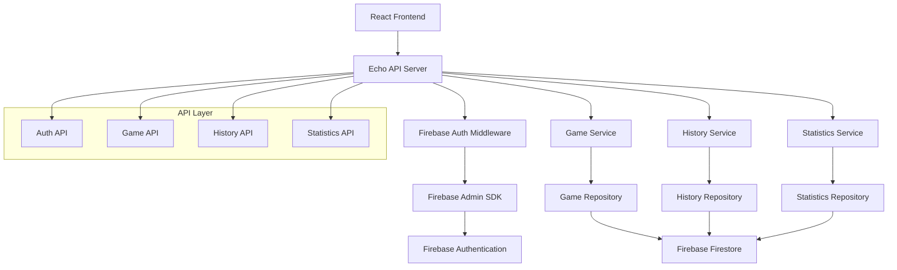

# バックエンド全体設計書

## 1. 概要

### 1.1 アプリケーション名
Scoring Bawlards/Bowling Backend API

### 1.2 機能の目的
ボーリングスコア記録・管理アプリケーションのバックエンドAPIシステム。ユーザー認証、ゲーム記録の管理、統計情報の提供を行う。

### 1.3 対象システム
- **フレームワーク**: Echo (Go)
- **データベース**: Firebase Firestore
- **認証**: Firebase Authentication
- **クラウドプラットフォーム**: Google Cloud Platform (GCP)
- **API仕様**: RESTful API

## 2. 技術スタック

### 2.1 バックエンド技術
- **フレームワーク**: Echo v4
- **言語**: Go 1.21+
- **データベース**: Firebase Firestore
- **Firestore SDK**: cloud.google.com/go/firestore
- **認証**: Firebase Admin SDK
- **バリデーション**: go-playground/validator
- **設定管理**: Viper
- **ログ**: Logrus
- **テスト**: Testify

### 2.2 外部サービス
- **Firebase Authentication**: ユーザー認証
- **Firebase Firestore**: データベース
- **Firebase Storage**: ファイル保存（将来拡張用）
- **Cloud Logging**: ログ管理

## 3. アーキテクチャ設計

### 3.1 全体構成図


### 3.2 プロジェクト構造
```
backend/
├── cmd/
│   └── server/
│       └── main.go
├── internal/
│   ├── config/
│   │   └── config.go
│   ├── middleware/
│   │   ├── auth.go
│   │   ├── cors.go
│   │   ├── logging.go
│   │   └── recovery.go
│   ├── handler/
│   │   ├── auth.go
│   │   ├── game.go
│   │   ├── history.go
│   │   └── statistics.go
│   ├── service/
│   │   ├── auth.go
│   │   ├── game.go
│   │   ├── history.go
│   │   └── statistics.go
│   ├── repository/
│   │   ├── game.go
│   │   ├── history.go
│   │   └── statistics.go
│   ├── model/
│   │   ├── user.go
│   │   ├── game.go
│   │   ├── frame.go
│   │   └── statistics.go
│   ├── dto/
│   │   ├── request.go
│   │   └── response.go
│   └── utils/
│       ├── validation.go
│       ├── scoring.go
│       └── pagination.go
├── firestore/
│   ├── security-rules/
│   │   └── firestore.rules
│   └── indexes/
│       └── firestore.indexes.json
├── tests/
│   ├── integration/
│   └── unit/
├── docker/
│   └── Dockerfile
├── go.mod
├── go.sum
└── README.md
```

## 4. Firebase Firestore設計

### 4.1 コレクション設計

#### 4.1.1 ユーザーコレクション (users)
```javascript
// コレクション: users
// ドキュメントID: Firebase UID
{
  "email": "user@example.com",
  "displayName": "ユーザー名",
  "photoURL": "https://example.com/photo.jpg",
  "createdAt": "2024-01-01T00:00:00Z",
  "updatedAt": "2024-01-01T00:00:00Z",
  "lastLoginAt": "2024-01-01T00:00:00Z"
}
```

#### 4.1.2 ゲームコレクション (games)
```javascript
// コレクション: games
// ドキュメントID: 自動生成UUID
{
  "userId": "firebase_uid",
  "gameDate": "2024-01-01T00:00:00Z",
  "totalScore": 150,
  "status": "completed", // "in_progress" | "completed"
  "frames": [
    {
      "frameNumber": 1,
      "firstRoll": 7,
      "secondRoll": 3,
      "thirdRoll": null,
      "frameScore": 10,
      "isStrike": false,
      "isSpare": true,
      "isCompleted": true
    }
    // ... 10フレーム分
  ],
  "statistics": {
    "strikeCount": 2,
    "spareCount": 3,
    "averageScore": 150.0
  },
  "createdAt": "2024-01-01T00:00:00Z",
  "updatedAt": "2024-01-01T00:00:00Z",
  "expireAt": "2024-04-01T00:00:00Z" // TTL用（3ヶ月後）
}
```

#### 4.1.3 ユーザー統計コレクション (userStatistics)
```javascript
// コレクション: userStatistics
// ドキュメントID: Firebase UID
{
  "userId": "firebase_uid",
  "totalGames": 25,
  "averageScore": 145.5,
  "highestScore": 200,
  "lowestScore": 80,
  "totalStrikes": 15,
  "totalSpares": 30,
  "gamesThisMonth": 8,
  "lastUpdated": "2024-01-01T00:00:00Z",
  "createdAt": "2024-01-01T00:00:00Z"
}
```

### 4.2 インデックス設計
- **複合インデックス**: ユーザー別ゲーム履歴取得用
- **単一フィールドインデックス**: 検索パフォーマンス向上用
- **TTLインデックス**: 自動削除機能用

## 5. API設計

### 5.1 エンドポイント一覧

#### 5.1.1 認証関連API
```
GET    /api/v1/user/profile          # ユーザープロフィール取得
PUT    /api/v1/user/profile          # ユーザープロフィール更新
```

#### 5.1.2 ゲーム関連API
```
POST   /api/v1/games                 # ゲーム作成
GET    /api/v1/games/:id             # ゲーム詳細取得
PUT    /api/v1/games/:id             # ゲーム更新
DELETE /api/v1/games/:id             # ゲーム削除
POST   /api/v1/games/:id/frames      # フレーム追加/更新
```

#### 5.1.3 履歴関連API
```
GET    /api/v1/games/history         # ゲーム履歴一覧
GET    /api/v1/games/statistics      # 統計情報取得
```

### 5.2 リクエスト/レスポンス形式

#### 5.2.1 共通レスポンス形式
```go
type APIResponse struct {
    Success bool        `json:"success"`
    Data    interface{} `json:"data,omitempty"`
    Error   *APIError   `json:"error,omitempty"`
    Meta    *Meta       `json:"meta,omitempty"`
}

type APIError struct {
    Code    string `json:"code"`
    Message string `json:"message"`
    Details string `json:"details,omitempty"`
}

type Meta struct {
    Pagination *Pagination `json:"pagination,omitempty"`
    Timestamp  string      `json:"timestamp"`
}
```

#### 5.2.2 ゲーム作成リクエスト
```go
type CreateGameRequest struct {
    GameDate string `json:"gameDate" validate:"required"`
}

type CreateGameResponse struct {
    Game Game `json:"game"`
}
```

#### 5.2.3 フレーム更新リクエスト
```go
type UpdateFrameRequest struct {
    FrameNumber int `json:"frameNumber" validate:"required,min=1,max=10"`
    RollNumber  int `json:"rollNumber" validate:"required,min=1,max=3"`
    Pins        int `json:"pins" validate:"required,min=0,max=10"`
}
```

## 6. ビジネスロジック設計

### 6.1 スコア計算ロジック

#### 6.1.1 フレームスコア計算
```go
func CalculateFrameScore(frame *Frame, nextFrames []*Frame) int {
    if frame.FrameNumber < 10 {
        // 1-9フレーム目
        if frame.IsStrike {
            return 10 + getStrikeBonus(nextFrames)
        } else if frame.IsSpare {
            return 10 + getSpareBonus(nextFrames[0])
        } else {
            return frame.FirstRoll + frame.SecondRoll
        }
    } else {
        // 10フレーム目
        return frame.FirstRoll + frame.SecondRoll + frame.ThirdRoll
    }
}

func getStrikeBonus(nextFrames []*Frame) int {
    if len(nextFrames) == 0 {
        return 0
    }
    
    nextFrame := nextFrames[0]
    if nextFrame.IsStrike {
        if len(nextFrames) > 1 {
            return 10 + nextFrames[1].FirstRoll
        } else {
            return 10 + nextFrame.SecondRoll
        }
    } else {
        return nextFrame.FirstRoll + nextFrame.SecondRoll
    }
}

func getSpareBonus(nextFrame *Frame) int {
    if nextFrame == nil {
        return 0
    }
    return nextFrame.FirstRoll
}
```

#### 6.1.2 ゲームスコア計算
```go
func CalculateGameScore(game *Game) int {
    totalScore := 0
    frames := game.Frames
    
    for i, frame := range frames {
        if frame.IsCompleted {
            remainingFrames := frames[i+1:]
            frameScore := CalculateFrameScore(frame, remainingFrames)
            frame.FrameScore = frameScore
            totalScore += frameScore
        }
    }
    
    return totalScore
}
```

### 6.2 統計計算ロジック

#### 6.2.1 ユーザー統計更新
```go
func UpdateUserStatistics(userID string) error {
    // 完了したゲームを取得
    completedGames, err := gameRepo.GetCompletedGamesByUser(userID)
    if err != nil {
        return err
    }
    
    if len(completedGames) == 0 {
        return nil
    }
    
    // 統計計算
    stats := &UserStatistics{
        UserID:        userID,
        TotalGames:    len(completedGames),
        AverageScore:  calculateAverageScore(completedGames),
        HighestScore:  calculateHighestScore(completedGames),
        LowestScore:   calculateLowestScore(completedGames),
        TotalStrikes:  calculateTotalStrikes(completedGames),
        TotalSpares:   calculateTotalSpares(completedGames),
        GamesThisMonth: calculateGamesThisMonth(completedGames),
    }
    
    return statsRepo.UpsertStatistics(stats)
}
```

## 7. ミドルウェア設計

### 7.1 認証ミドルウェア
```go
func FirebaseAuthMiddleware() echo.MiddlewareFunc {
    return func(next echo.HandlerFunc) echo.HandlerFunc {
        return func(c echo.Context) error {
            // Authorizationヘッダーからトークン取得
            authHeader := c.Request().Header.Get("Authorization")
            if authHeader == "" {
                return c.JSON(401, APIResponse{
                    Success: false,
                    Error: &APIError{
                        Code:    "UNAUTHORIZED",
                        Message: "Authorization header required",
                    },
                })
            }
            
            token := strings.TrimPrefix(authHeader, "Bearer ")
            if token == authHeader {
                return c.JSON(401, APIResponse{
                    Success: false,
                    Error: &APIError{
                        Code:    "INVALID_TOKEN_FORMAT",
                        Message: "Invalid token format",
                    },
                })
            }
            
            // Firebase Admin SDKでトークン検証
            decodedToken, err := verifyFirebaseToken(token)
            if err != nil {
                return c.JSON(401, APIResponse{
                    Success: false,
                    Error: &APIError{
                        Code:    "INVALID_TOKEN",
                        Message: "Invalid or expired token",
                    },
                })
            }
            
            // ユーザー情報をコンテキストに設定
            c.Set("user", decodedToken.Claims)
            return next(c)
        }
    }
}
```

### 7.2 CORSミドルウェア
```go
func CORSMiddleware() echo.MiddlewareFunc {
    return middleware.CORSWithConfig(middleware.CORSConfig{
        AllowOrigins: []string{"http://localhost:3000", "https://yourdomain.com"},
        AllowMethods: []string{echo.GET, echo.POST, echo.PUT, echo.DELETE, echo.OPTIONS},
        AllowHeaders: []string{echo.HeaderOrigin, echo.HeaderContentType, echo.HeaderAccept, echo.HeaderAuthorization},
        AllowCredentials: true,
    })
}
```

### 7.3 ログミドルウェア
```go
func LoggingMiddleware() echo.MiddlewareFunc {
    return middleware.LoggerWithConfig(middleware.LoggerConfig{
        Format: "${time_rfc3339} ${status} ${method} ${uri} ${latency_human}\n",
        Output: os.Stdout,
    })
}
```

### 7.4 リカバリーミドルウェア
```go
func RecoveryMiddleware() echo.MiddlewareFunc {
    return middleware.RecoverWithConfig(middleware.RecoverConfig{
        DisableStackAll: false,
        DisablePrintStack: false,
    })
}
```

## 8. エラーハンドリング

### 8.1 エラーコード定義
```go
const (
    ErrCodeUnauthorized     = "UNAUTHORIZED"
    ErrCodeForbidden        = "FORBIDDEN"
    ErrCodeNotFound         = "NOT_FOUND"
    ErrCodeValidationError  = "VALIDATION_ERROR"
    ErrCodeInternalError    = "INTERNAL_ERROR"
    ErrCodeGameNotFound     = "GAME_NOT_FOUND"
    ErrCodeInvalidFrame     = "INVALID_FRAME"
    ErrCodeGameCompleted    = "GAME_COMPLETED"
)
```

### 8.2 カスタムエラー
```go
type AppError struct {
    Code    string
    Message string
    Details string
    Status  int
}

func (e *AppError) Error() string {
    return e.Message
}

func NewValidationError(message string) *AppError {
    return &AppError{
        Code:    ErrCodeValidationError,
        Message: message,
        Status:  http.StatusBadRequest,
    }
}
```

### 8.3 エラーハンドラー
```go
func ErrorHandler(err error, c echo.Context) {
    if appErr, ok := err.(*AppError); ok {
        c.JSON(appErr.Status, APIResponse{
            Success: false,
            Error: &APIError{
                Code:    appErr.Code,
                Message: appErr.Message,
                Details: appErr.Details,
            },
        })
        return
    }
    
    // デフォルトエラー
    c.JSON(http.StatusInternalServerError, APIResponse{
        Success: false,
        Error: &APIError{
            Code:    ErrCodeInternalError,
            Message: "Internal server error",
        },
    })
}
```

## 9. バリデーション設計

### 9.1 リクエストバリデーション
```go
type GameValidator struct {
    validator *validator.Validate
}

func NewGameValidator() *GameValidator {
    v := validator.New()
    v.RegisterValidation("valid_pins", validatePins)
    v.RegisterValidation("valid_frame", validateFrame)
    return &GameValidator{validator: v}
}

func validatePins(fl validator.FieldLevel) bool {
    pins := fl.Field().Int()
    return pins >= 0 && pins <= 10
}

func validateFrame(fl validator.FieldLevel) bool {
    frame := fl.Field().Int()
    return frame >= 1 && frame <= 10
}
```

### 9.2 ビジネスルールバリデーション
```go
func ValidateFrameInput(game *Game, frameNumber, rollNumber, pins int) error {
    // ゲームが完了しているかチェック
    if game.Status == "completed" {
        return NewValidationError("Cannot update completed game")
    }
    
    // フレーム番号の妥当性チェック
    if frameNumber < 1 || frameNumber > 10 {
        return NewValidationError("Invalid frame number")
    }
    
    // ピン数の妥当性チェック
    if pins < 0 || pins > 10 {
        return NewValidationError("Invalid pins count")
    }
    
    // フレーム別の制約チェック
    if frameNumber < 10 {
        if rollNumber == 2 {
            frame := game.GetFrame(frameNumber)
            if frame.FirstRoll+int64(pins) > 10 {
                return NewValidationError("Total pins cannot exceed 10")
            }
        }
    }
    
    return nil
}
```

## 10. 設定管理

### 10.1 設定構造体
```go
type Config struct {
    Server    ServerConfig    `mapstructure:"server"`
    Firestore FirestoreConfig `mapstructure:"firestore"`
    Firebase  FirebaseConfig  `mapstructure:"firebase"`
    Log       LogConfig       `mapstructure:"log"`
}

type ServerConfig struct {
    Port string `mapstructure:"port"`
    Host string `mapstructure:"host"`
}

type FirestoreConfig struct {
    ProjectID string `mapstructure:"project_id"`
    KeyFile   string `mapstructure:"key_file"`
}

type FirebaseConfig struct {
    ProjectID      string `mapstructure:"project_id"`
    PrivateKey     string `mapstructure:"private_key"`
    ClientEmail    string `mapstructure:"client_email"`
}

type LogConfig struct {
    Level  string `mapstructure:"level"`
    Format string `mapstructure:"format"`
}
```

### 10.2 設定読み込み
```go
func LoadConfig() (*Config, error) {
    viper.SetConfigName("config")
    viper.SetConfigType("yaml")
    viper.AddConfigPath(".")
    viper.AddConfigPath("./config")
    
    // 環境変数から読み込み
    viper.AutomaticEnv()
    viper.SetEnvKeyReplacer(strings.NewReplacer(".", "_"))
    
    if err := viper.ReadInConfig(); err != nil {
        return nil, fmt.Errorf("error reading config file: %w", err)
    }
    
    var config Config
    if err := viper.Unmarshal(&config); err != nil {
        return nil, fmt.Errorf("error unmarshaling config: %w", err)
    }
    
    return &config, nil
}
```

## 11. テスト設計

### 11.1 単体テスト
```go
func TestCalculateFrameScore(t *testing.T) {
    tests := []struct {
        name     string
        frame    *Frame
        nextFrames []*Frame
        expected int
    }{
        {
            name: "Strike with next two rolls",
            frame: &Frame{FrameNumber: 1, FirstRoll: 10, IsStrike: true},
            nextFrames: []*Frame{
                {FirstRoll: 7, SecondRoll: 2},
            },
            expected: 19,
        },
        {
            name: "Spare with next roll",
            frame: &Frame{FrameNumber: 1, FirstRoll: 7, SecondRoll: 3, IsSpare: true},
            nextFrames: []*Frame{
                {FirstRoll: 5},
            },
            expected: 15,
        },
    }
    
    for _, tt := range tests {
        t.Run(tt.name, func(t *testing.T) {
            result := CalculateFrameScore(tt.frame, tt.nextFrames)
            assert.Equal(t, tt.expected, result)
        })
    }
}
```

### 11.2 統合テスト
```go
func TestGameAPI(t *testing.T) {
    // テスト用のEchoインスタンス作成
    e := echo.New()
    
    // テスト用のデータベース設定
    db := setupTestDB()
    defer cleanupTestDB(db)
    
    // ハンドラー設定
    gameHandler := NewGameHandler(gameService)
    e.POST("/api/v1/games", gameHandler.CreateGame)
    
    // テストケース実行
    tests := []struct {
        name           string
        requestBody    string
        expectedStatus int
    }{
        {
            name:           "Valid game creation",
            requestBody:    `{"gameDate": "2024-01-01T00:00:00Z"}`,
            expectedStatus: 201,
        },
    }
    
    for _, tt := range tests {
        t.Run(tt.name, func(t *testing.T) {
            req := httptest.NewRequest(http.MethodPost, "/api/v1/games", strings.NewReader(tt.requestBody))
            req.Header.Set("Content-Type", "application/json")
            req.Header.Set("Authorization", "Bearer test-token")
            
            rec := httptest.NewRecorder()
            e.ServeHTTP(rec, req)
            
            assert.Equal(t, tt.expectedStatus, rec.Code)
        })
    }
}
```

## 12. セキュリティ設計

### 12.1 認証・認可
- **Firebase Authentication**: ユーザー認証
- **JWT Token検証**: リクエストごとの認証
- **ユーザー分離**: ユーザーごとのデータ分離

### 12.2 データ保護
- **SQLインジェクション対策**: GORMのパラメータ化クエリ
- **XSS対策**: レスポンスヘッダー設定
- **CSRF対策**: SameSite Cookie設定

### 12.3 レート制限
```go
func RateLimitMiddleware() echo.MiddlewareFunc {
    return func(next echo.HandlerFunc) echo.HandlerFunc {
        return func(c echo.Context) error {
            // レート制限ロジック実装
            // 例: 1分間に100リクエストまで
            return next(c)
        }
    }
}
```

## 13. パフォーマンス設計

### 13.1 データベース最適化
- **インデックス設計**: 検索パフォーマンス向上
- **クエリ最適化**: N+1問題の回避
- **接続プール**: データベース接続の効率化

### 13.2 キャッシュ戦略
```go
type CacheService struct {
    redis *redis.Client
}

func (c *CacheService) GetUserStatistics(userID string) (*UserStatistics, error) {
    key := fmt.Sprintf("user_stats:%s", userID)
    
    // キャッシュから取得
    cached, err := c.redis.Get(key).Result()
    if err == nil {
        var stats UserStatistics
        json.Unmarshal([]byte(cached), &stats)
        return &stats, nil
    }
    
    // データベースから取得
    stats, err := c.getUserStatisticsFromDB(userID)
    if err != nil {
        return nil, err
    }
    
    // キャッシュに保存（5分間）
    data, _ := json.Marshal(stats)
    c.redis.Set(key, data, 5*time.Minute)
    
    return stats, nil
}
```

## 14. 監視・ログ設計

### 14.1 ログ設計
```go
type Logger struct {
    *logrus.Logger
}

func NewLogger(config *LogConfig) *Logger {
    logger := logrus.New()
    
    level, _ := logrus.ParseLevel(config.Level)
    logger.SetLevel(level)
    
    if config.Format == "json" {
        logger.SetFormatter(&logrus.JSONFormatter{})
    }
    
    return &Logger{logger}
}

func (l *Logger) LogRequest(c echo.Context, duration time.Duration) {
    l.WithFields(logrus.Fields{
        "method":   c.Request().Method,
        "uri":      c.Request().RequestURI,
        "status":   c.Response().Status,
        "duration": duration,
        "ip":       c.RealIP(),
    }).Info("Request completed")
}
```

### 14.2 メトリクス設計
- **リクエスト数**: エンドポイント別リクエスト数
- **レスポンス時間**: 平均・最大レスポンス時間
- **エラー率**: エンドポイント別エラー率
- **データベース接続数**: アクティブ接続数

## 15. デプロイ設計

### 15.1 Docker設定
```dockerfile
FROM golang:1.21-alpine AS builder

WORKDIR /app
COPY go.mod go.sum ./
RUN go mod download

COPY . .
RUN go build -o main cmd/server/main.go

FROM alpine:latest
RUN apk --no-cache add ca-certificates
WORKDIR /root/

COPY --from=builder /app/main .
COPY --from=builder /app/migrations ./migrations

EXPOSE 8080
CMD ["./main"]
```

### 15.2 環境設定
```yaml
# config.yaml
server:
  port: "8080"
  host: "0.0.0.0"

firestore:
  project_id: "${FIRESTORE_PROJECT_ID}"
  key_file: "${FIRESTORE_KEY_FILE}"

firebase:
  project_id: "${FIREBASE_PROJECT_ID}"
  private_key: "${FIREBASE_PRIVATE_KEY}"
  client_email: "${FIREBASE_CLIENT_EMAIL}"

log:
  level: "info"
  format: "json"
```

## 16. 依存関係

### 16.1 Go Modules
```go
module scoring-bawlards-backend

go 1.21

require (
    github.com/labstack/echo/v4 v4.11.1
    github.com/go-playground/validator/v10 v10.14.1
    github.com/spf13/viper v1.16.0
    github.com/sirupsen/logrus v1.9.3
    github.com/stretchr/testify v1.8.4
    cloud.google.com/go/firestore v1.13.0
    firebase.google.com/go/v4 v4.11.0
    github.com/go-redis/redis/v8 v8.11.5
)
```

## 17. 変更履歴

| バージョン | 日付 | 変更内容 | 担当者 |
|-----------|------|----------|--------|
| 1.0.0 | 2024-01-01 | 初版作成 | システムエンジニア |
| 2.0.0 | 2024-09-19 | Firebase Firestore版に移行 | システムエンジニア |

---

**注意事項**:
- 本設計書は定期的にレビューし、最新の状態を保つこと
- 新しい機能追加時は、必ず設計書を更新すること
- セキュリティ要件の変更時は、設計書を更新すること
