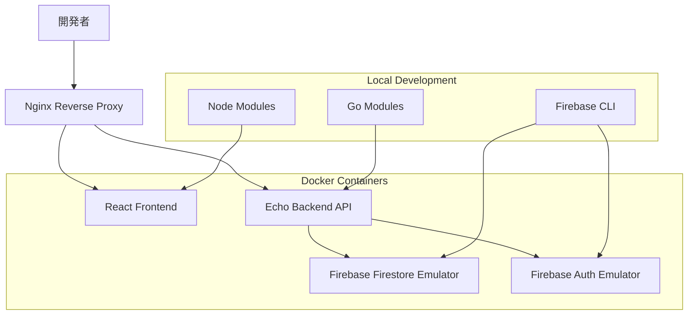

# 開発環境構築設計書

## 1. 概要

### 1.1 開発環境の目的
DockerとFirebaseエミュレータを使用したローカル開発環境を構築し、本番環境に近い環境での開発・テストを可能にする。

### 1.2 対象システム
- **コンテナ**: Docker & Docker Compose
- **データベース**: Firebase Firestore Emulator
- **認証**: Firebase Authentication Emulator
- **バックエンド**: Echo (Go) (Docker)
- **フロントエンド**: React (Docker)
- **リバースプロキシ**: Nginx (Docker)

## 2. 開発環境構成

### 2.1 全体構成図


### 2.2 サービス構成
- **nginx**: リバースプロキシ、静的ファイル配信
- **frontend**: React開発サーバー
- **backend**: Echo APIサーバー
- **firebase-firestore**: Firebase Firestoreエミュレータ
- **firebase-auth**: Firebase認証エミュレータ

## 3. Docker設定

### 3.1 プロジェクト構造
```
bowlards/
├── docker/
│   ├── nginx/
│   │   └── nginx.conf
│   └── firebase/
│       ├── firebase.json
│       ├── firestore.rules
│       └── firestore.indexes.json
├── backend/
│   ├── Dockerfile
│   └── ...
├── frontend/
│   ├── Dockerfile
│   └── ...
├── docker-compose.yml
├── docker-compose.override.yml
├── .env.example
└── README.md
```

### 3.2 docker-compose.yml
```yaml
version: '3.8'

services:
  nginx:
    image: nginx:alpine
    ports:
      - "80:80"
      - "443:443"
    volumes:
      - ./docker/nginx/nginx.conf:/etc/nginx/nginx.conf
      - ./frontend/dist:/usr/share/nginx/html/frontend
    depends_on:
      - frontend
      - backend
    networks:
      - bowlards-network

  frontend:
    build:
      context: ./frontend
      dockerfile: Dockerfile
    ports:
      - "3000:3000"
    volumes:
      - ./frontend:/app
      - /app/node_modules
    environment:
      - NODE_ENV=development
      - REACT_APP_API_BASE_URL=http://localhost/api/v1
      - REACT_APP_FIREBASE_AUTH_EMULATOR_HOST=localhost
      - REACT_APP_FIREBASE_AUTH_EMULATOR_PORT=9099
    depends_on:
      - backend
    networks:
      - bowlards-network

  backend:
    build:
      context: ./backend
      dockerfile: Dockerfile
    ports:
      - "8080:8080"
    volumes:
      - ./backend:/app
      - /app/vendor
    environment:
      - FIRESTORE_EMULATOR_HOST=firebase-firestore
      - FIRESTORE_EMULATOR_PORT=8080
      - FIREBASE_AUTH_EMULATOR_HOST=firebase-auth
      - FIREBASE_AUTH_EMULATOR_PORT=9099
    depends_on:
      - firebase-firestore
      - firebase-auth
    networks:
      - bowlards-network

  firebase-firestore:
    image: node:18-alpine
    ports:
      - "8080:8080"
    volumes:
      - ./docker/firebase:/app
      - firebase_data:/root/.config/firebase
    working_dir: /app
    command: firebase emulators:start --only firestore --project bowlards-dev
    networks:
      - bowlards-network

  firebase-auth:
    image: node:18-alpine
    ports:
      - "9099:9099"
    volumes:
      - ./docker/firebase:/app
      - firebase_data:/root/.config/firebase
    working_dir: /app
    command: firebase emulators:start --only auth --project bowlards-dev
    networks:
      - bowlards-network

volumes:
  firebase_data:

networks:
  bowlards-network:
    driver: bridge
```

### 3.3 docker-compose.override.yml
```yaml
version: '3.8'

services:
  frontend:
    volumes:
      - ./frontend:/app
      - /app/node_modules
    environment:
      - CHOKIDAR_USEPOLLING=true
      - WATCHPACK_POLLING=true

  backend:
    volumes:
      - ./backend:/app
      - /app/vendor
    environment:
      - CGO_ENABLED=0
      - GOOS=linux
      - GOARCH=amd64
```

## 4. 各サービスのDockerfile

### 4.1 フロントエンド (frontend/Dockerfile)
```dockerfile
FROM node:18-alpine

WORKDIR /app

# パッケージファイルをコピー
COPY package*.json ./

# 依存関係をインストール
RUN npm ci

# ソースコードをコピー
COPY . .

# 開発サーバーを起動
EXPOSE 3000

CMD ["npm", "run", "dev"]
```

### 4.2 バックエンド (backend/Dockerfile)
```dockerfile
FROM golang:1.21-alpine

WORKDIR /app

# 必要なパッケージをインストール
RUN apk add --no-cache git

# Go modulesをコピー
COPY go.mod go.sum ./

# 依存関係をダウンロード
RUN go mod download

# ソースコードをコピー
COPY . .

# アプリケーションをビルド
RUN go build -o main cmd/server/main.go

# ポートを公開
EXPOSE 8080

# アプリケーションを実行
CMD ["./main"]
```

## 5. Nginx設定

### 5.1 nginx.conf
```nginx
events {
    worker_connections 1024;
}

http {
    upstream frontend {
        server frontend:3000;
    }

    upstream backend {
        server backend:8080;
    }

    server {
        listen 80;
        server_name localhost;

        # フロントエンド
        location / {
            proxy_pass http://frontend;
            proxy_set_header Host $host;
            proxy_set_header X-Real-IP $remote_addr;
            proxy_set_header X-Forwarded-For $proxy_add_x_forwarded_for;
            proxy_set_header X-Forwarded-Proto $scheme;
        }

        # バックエンドAPI
        location /api/ {
            proxy_pass http://backend;
            proxy_set_header Host $host;
            proxy_set_header X-Real-IP $remote_addr;
            proxy_set_header X-Forwarded-For $proxy_add_x_forwarded_for;
            proxy_set_header X-Forwarded-Proto $scheme;
        }

        # Firebase Auth Emulator
        location /auth/ {
            proxy_pass http://firebase-auth:9099/;
            proxy_set_header Host $host;
            proxy_set_header X-Real-IP $remote_addr;
            proxy_set_header X-Forwarded-For $proxy_add_x_forwarded_for;
            proxy_set_header X-Forwarded-Proto $scheme;
        }
    }
}
```

## 6. Firebase設定

### 6.1 firebase.json
```json
{
  "emulators": {
    "auth": {
      "port": 9099,
      "host": "0.0.0.0"
    },
    "firestore": {
      "port": 8080,
      "host": "0.0.0.0"
    },
    "ui": {
      "enabled": true,
      "port": 4000,
      "host": "0.0.0.0"
    }
  },
  "projects": {
    "bowlards-dev": {
      "auth": {
        "emulator": {
          "port": 9099,
          "host": "0.0.0.0"
        }
      },
      "firestore": {
        "emulator": {
          "port": 8080,
          "host": "0.0.0.0"
        }
      }
    }
  }
}
```

### 6.2 Firebase初期化スクリプト
```javascript
// firebase-init.js
const admin = require('firebase-admin');

// エミュレータ用の設定
process.env.FIREBASE_AUTH_EMULATOR_HOST = 'firebase-auth:9099';
process.env.FIRESTORE_EMULATOR_HOST = 'firebase-firestore:8080';

// Firebase Admin SDKを初期化
admin.initializeApp({
  projectId: 'bowlards-dev',
});

// テスト用ユーザーとデータを作成
async function createTestData() {
  const auth = admin.auth();
  const db = admin.firestore();
  
  try {
    // テストユーザー1
    await auth.createUser({
      uid: 'test-user-1',
      email: 'test1@example.com',
      displayName: 'テストユーザー1',
      password: 'password123'
    });
    
    // テストユーザー2
    await auth.createUser({
      uid: 'test-user-2',
      email: 'test2@example.com',
      displayName: 'テストユーザー2',
      password: 'password123'
    });
    
    // テスト用ゲームデータを作成
    await db.collection('games').add({
      userId: 'test-user-1',
      gameDate: new Date(),
      totalScore: 150,
      status: 'completed',
      frames: [],
      statistics: {
        strikeCount: 3,
        spareCount: 2,
        averageScore: 150.0
      },
      createdAt: new Date(),
      updatedAt: new Date(),
      expireAt: new Date(Date.now() + 90 * 24 * 60 * 60 * 1000)
    });
    
    console.log('Test data created successfully');
  } catch (error) {
    console.error('Error creating test data:', error);
  }
}

createTestData();
```

## 7. Firestoreセキュリティルール

### 7.1 firestore.rules
```javascript
rules_version = '2';
service cloud.firestore {
  match /databases/{database}/documents {
    // ユーザー情報
    match /users/{userId} {
      allow read, write: if request.auth != null && 
        request.auth.uid == userId;
    }
    
    // ゲーム記録
    match /games/{gameId} {
      allow read, write: if request.auth != null && 
        request.auth.uid == resource.data.userId;
      allow create: if request.auth != null && 
        request.auth.uid == request.resource.data.userId;
    }
    
    // ユーザー統計
    match /userStatistics/{userId} {
      allow read, write: if request.auth != null && 
        request.auth.uid == userId;
    }
  }
}
```

### 7.2 firestore.indexes.json
```json
{
  "indexes": [
    {
      "collectionGroup": "games",
      "queryScope": "COLLECTION",
      "fields": [
        {
          "fieldPath": "userId",
          "order": "ASCENDING"
        },
        {
          "fieldPath": "gameDate",
          "order": "DESCENDING"
        }
      ]
    },
    {
      "collectionGroup": "games",
      "queryScope": "COLLECTION",
      "fields": [
        {
          "fieldPath": "userId",
          "order": "ASCENDING"
        },
        {
          "fieldPath": "status",
          "order": "ASCENDING"
        }
      ]
    }
  ],
  "fieldOverrides": []
}
```

## 8. 環境変数設定

### 8.1 .env.example
```bash
# Firebase設定
FIREBASE_PROJECT_ID=bowlards-dev
FIRESTORE_EMULATOR_HOST=firebase-firestore
FIRESTORE_EMULATOR_PORT=8080
FIREBASE_AUTH_EMULATOR_HOST=firebase-auth
FIREBASE_AUTH_EMULATOR_PORT=9099

# アプリケーション設定
APP_ENV=development
APP_PORT=8080
APP_HOST=0.0.0.0

# ログ設定
LOG_LEVEL=debug
LOG_FORMAT=json

# CORS設定
CORS_ALLOWED_ORIGINS=http://localhost:3000,http://localhost:80
CORS_ALLOWED_METHODS=GET,POST,PUT,DELETE,OPTIONS
CORS_ALLOWED_HEADERS=Authorization,Content-Type
```

### 8.2 .env
```bash
# .env.exampleをコピーして作成
cp .env.example .env
```

## 9. 開発用スクリプト

### 9.1 package.json (ルート)
```json
{
  "name": "bowlards-dev",
  "version": "1.0.0",
  "scripts": {
    "dev": "docker-compose up -d",
    "dev:build": "docker-compose up --build -d",
    "dev:down": "docker-compose down",
    "dev:logs": "docker-compose logs -f",
    "dev:clean": "docker-compose down -v --remove-orphans",
    "firestore:init": "docker-compose exec firebase-firestore firebase emulators:exec --only firestore 'node firebase-init.js'",
    "test": "docker-compose exec backend go test ./...",
    "test:frontend": "docker-compose exec frontend npm test",
    "lint:backend": "docker-compose exec backend golangci-lint run",
    "lint:frontend": "docker-compose exec frontend npm run lint"
  }
}
```

### 9.2 Makefile
```makefile
.PHONY: dev dev-build dev-down dev-logs dev-clean db-migrate db-seed test test-frontend lint-backend lint-frontend

# 開発環境起動
dev:
	docker-compose up -d

# 開発環境再ビルド
dev-build:
	docker-compose up --build -d

# 開発環境停止
dev-down:
	docker-compose down

# ログ確認
dev-logs:
	docker-compose logs -f

# 開発環境クリーンアップ
dev-clean:
	docker-compose down -v --remove-orphans

# Firestore初期化
firestore-init:
	docker-compose exec firebase-firestore firebase emulators:exec --only firestore 'node firebase-init.js'

# バックエンドテスト
test:
	docker-compose exec backend go test ./...

# フロントエンドテスト
test-frontend:
	docker-compose exec frontend npm test

# バックエンドリント
lint-backend:
	docker-compose exec backend golangci-lint run

# フロントエンドリント
lint-frontend:
	docker-compose exec frontend npm run lint
```

## 10. 開発手順

### 10.1 初回セットアップ
```bash
# リポジトリクローン
git clone <repository-url>
cd bowlards

# 環境変数設定
cp .env.example .env

# Firebase CLIインストール
npm install -g firebase-tools

# Firebaseログイン
firebase login

# Firebaseプロジェクト初期化
firebase init

# 開発環境起動
make dev-build

# Firestore初期化
make firestore-init
```

### 10.2 日常の開発作業
```bash
# 開発環境起動
make dev

# ログ確認
make dev-logs

# テスト実行
make test
make test-frontend

# リント実行
make lint-backend
make lint-frontend

# 開発環境停止
make dev-down
```

## 11. トラブルシューティング

### 11.1 よくある問題

#### 11.1.1 ポート競合
```bash
# 使用中のポート確認
lsof -i :80
lsof -i :3000
lsof -i :8080
lsof -i :3306
lsof -i :9099

# プロセス終了
kill -9 <PID>
```

#### 11.1.2 Firestore接続エラー
```bash
# Firestoreエミュレータ確認
docker-compose ps firebase-firestore

# Firestoreログ確認
docker-compose logs firebase-firestore

# Firestoreエミュレータ再起動
docker-compose restart firebase-firestore
```

#### 11.1.3 Firebase認証エラー
```bash
# Firebaseエミュレータ確認
docker-compose ps firebase-auth

# Firebaseログ確認
docker-compose logs firebase-auth

# Firebaseエミュレータ再起動
docker-compose restart firebase-auth
```

### 11.2 デバッグ方法

#### 11.2.1 コンテナ内でのデバッグ
```bash
# バックエンドコンテナに入る
docker-compose exec backend sh

# フロントエンドコンテナに入る
docker-compose exec frontend sh

# Firestoreエミュレータに入る
docker-compose exec firebase-firestore sh
```

#### 11.2.2 ログレベル変更
```bash
# 環境変数でログレベル変更
LOG_LEVEL=debug docker-compose up -d
```

## 12. 本番環境との違い

### 12.1 開発環境固有の設定
- **認証**: Firebaseエミュレータ使用
- **データベース**: Firebase Firestoreエミュレータ
- **HTTPS**: 無効（HTTPのみ）
- **ログレベル**: DEBUG
- **CORS**: 緩い設定

### 12.2 本番環境移行時の注意点
- **環境変数**: 本番用に変更
- **認証**: 本番Firebaseプロジェクト
- **データベース**: 本番Firebase Firestore
- **HTTPS**: 有効化
- **セキュリティ**: 厳格な設定

## 13. 変更履歴

| バージョン | 日付 | 変更内容 | 担当者 |
|-----------|------|----------|--------|
| 1.0.0 | 2024-01-01 | 初版作成 | システムエンジニア |
| 2.0.0 | 2024-09-19 | Firebase Firestoreエミュレータ対応 | システムエンジニア |

---

**注意事項**:
- 本設計書は定期的にレビューし、最新の状態を保つこと
- 新しいサービス追加時は、必ず設計書を更新すること
- セキュリティ要件の変更時は、設計書を更新すること
