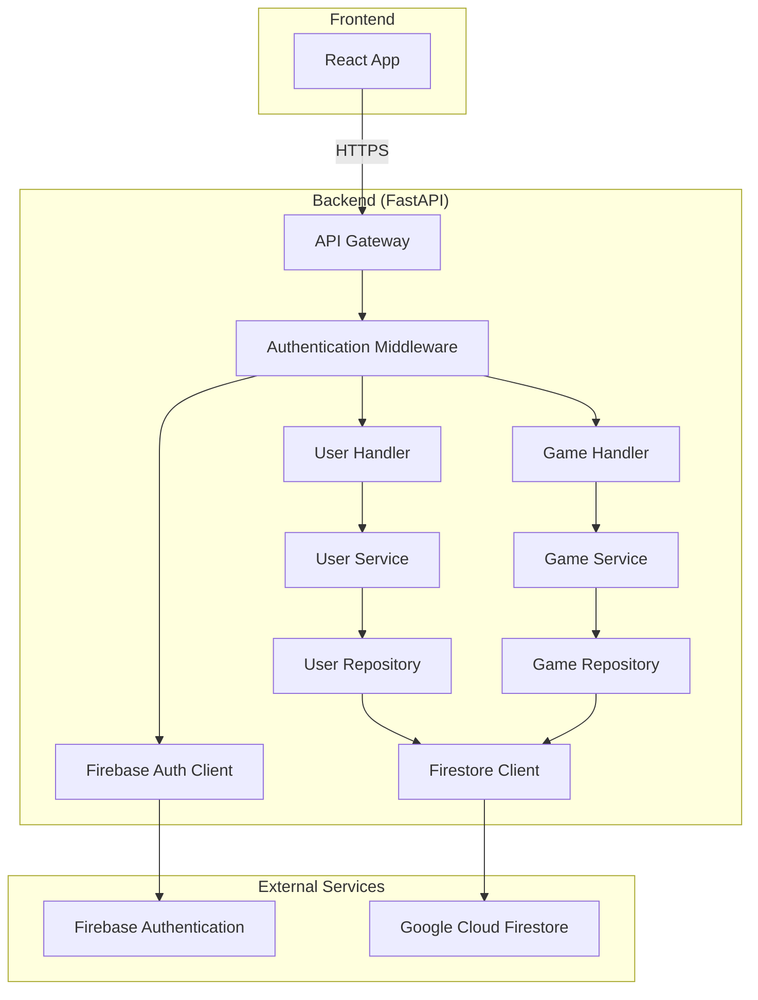

# FastAPIバックエンド全体設計書

## 1. 概要

### 1.1 目的
ボーリングスコア記録・管理アプリケーション「Scoring Bowlards/Bowling」のバックエンドAPIサーバーをPythonのFastAPIフレームワークで構築する。

### 1.2 技術スタック
- **フレームワーク**: FastAPI 0.104+
- **言語**: Python 3.11+
- **データベース**: Google Cloud Firestore
- **認証**: Firebase Authentication
- **クラウド**: Google Cloud Platform (GCP)
- **コンテナ**: Docker
- **ASGIサーバー**: Uvicorn
- **バリデーション**: Pydantic
- **ログ**: Python logging + structlog

## 2. アーキテクチャ設計

### 2.1 全体構成図



### 2.2 ディレクトリ構造

```
backend/
├── app/
│   ├── __init__.py
│   ├── main.py                 # FastAPIアプリケーションエントリーポイント
│   ├── config.py              # 設定管理
│   ├── dependencies.py        # 依存性注入
│   ├── middleware.py          # カスタムミドルウェア
│   ├── exceptions.py          # カスタム例外
│   ├── models/                # Pydanticモデル
│   │   ├── __init__.py
│   │   ├── user.py
│   │   ├── game.py
│   │   ├── common.py
│   │   └── responses.py
│   ├── schemas/               # データベーススキーマ
│   │   ├── __init__.py
│   │   ├── user.py
│   │   └── game.py
│   ├── services/              # ビジネスロジック
│   │   ├── __init__.py
│   │   ├── user_service.py
│   │   └── game_service.py
│   ├── repositories/          # データアクセス層
│   │   ├── __init__.py
│   │   ├── user_repository.py
│   │   └── game_repository.py
│   ├── routers/               # APIルーター
│   │   ├── __init__.py
│   │   ├── auth.py
│   │   ├── users.py
│   │   └── games.py
│   ├── auth/                  # 認証関連
│   │   ├── __init__.py
│   │   ├── firebase.py
│   │   └── dependencies.py
│   └── utils/                 # ユーティリティ
│       ├── __init__.py
│       ├── logging.py
│       ├── validators.py
│       └── scoring.py
├── tests/                     # テストコード
│   ├── __init__.py
│   ├── conftest.py
│   ├── test_auth.py
│   ├── test_users.py
│   └── test_games.py
├── requirements.txt           # Python依存関係
├── requirements-dev.txt       # 開発用依存関係
├── Dockerfile
├── .env.example
└── README.md
```

## 3. 主要コンポーネント設計

### 3.1 FastAPIアプリケーション設定

```python
# app/main.py
from fastapi import FastAPI
from fastapi.middleware.cors import CORSMiddleware
from fastapi.middleware.trustedhost import TrustedHostMiddleware
import uvicorn

app = FastAPI(
    title="Scoring Bowlards API",
    description="ボーリングスコア記録・管理アプリケーションのAPI",
    version="1.0.0",
    docs_url="/docs",
    redoc_url="/redoc"
)

# CORS設定
app.add_middleware(
    CORSMiddleware,
    allow_origins=["*"],  # 本番環境では適切に制限
    allow_credentials=True,
    allow_methods=["*"],
    allow_headers=["*"],
)
```

### 3.2 設定管理

```python
# app/config.py
from pydantic_settings import BaseSettings
from typing import Optional

class Settings(BaseSettings):
    # サーバー設定
    host: str = "0.0.0.0"
    port: int = 8000
    debug: bool = False
    
    # Firebase設定
    firebase_project_id: str
    firebase_credentials_path: Optional[str] = None
    
    # ログ設定
    log_level: str = "INFO"
    log_format: str = "json"
    
    class Config:
        env_file = ".env"
        env_prefix = "APP_"
```

### 3.3 認証システム

```python
# app/auth/firebase.py
from firebase_admin import auth, credentials, initialize_app
from fastapi import HTTPException, Depends
from fastapi.security import HTTPBearer, HTTPAuthorizationCredentials

security = HTTPBearer()

class FirebaseAuth:
    def __init__(self):
        # Firebase初期化
        if not firebase_admin._apps:
            cred = credentials.Certificate(settings.firebase_credentials_path)
            initialize_app(cred)
    
    async def verify_token(self, token: str) -> dict:
        try:
            decoded_token = auth.verify_id_token(token)
            return decoded_token
        except Exception as e:
            raise HTTPException(status_code=401, detail="Invalid token")

async def get_current_user(
    credentials: HTTPAuthorizationCredentials = Depends(security)
) -> dict:
    auth = FirebaseAuth()
    return await auth.verify_token(credentials.credentials)
```

### 3.4 データモデル設計

#### 3.4.1 ユーザーモデル

```python
# app/models/user.py
from pydantic import BaseModel, EmailStr
from datetime import datetime
from typing import Optional

class UserBase(BaseModel):
    email: EmailStr
    display_name: str
    photo_url: Optional[str] = None

class UserCreate(UserBase):
    pass

class UserUpdate(BaseModel):
    display_name: Optional[str] = None
    photo_url: Optional[str] = None

class UserResponse(UserBase):
    id: str
    uid: str
    created_at: datetime
    updated_at: datetime
    
    class Config:
        from_attributes = True
```

#### 3.4.2 ゲームモデル

```python
# app/models/game.py
from pydantic import BaseModel, Field, validator
from datetime import datetime
from typing import List, Optional

class Frame(BaseModel):
    number: int = Field(..., ge=1, le=10)
    rolls: List[int] = Field(default_factory=list)
    score: int = 0
    is_strike: bool = False
    is_spare: bool = False
    is_completed: bool = False

class GameBase(BaseModel):
    user_id: str
    total_score: int = 0
    frames: List[Frame] = Field(default_factory=list)
    status: str = "playing"
    played_at: datetime = Field(default_factory=datetime.now)

class GameCreate(GameBase):
    pass

class RollRequest(BaseModel):
    frame_number: int = Field(..., ge=1, le=10)
    pin_count: int = Field(..., ge=0, le=10)
    
    @validator('pin_count')
    def validate_pin_count(cls, v, values):
        frame_number = values.get('frame_number')
        if frame_number < 10 and v > 10:
            raise ValueError('Pin count cannot exceed 10 for frames 1-9')
        return v

class GameResponse(GameBase):
    id: str
    created_at: datetime
    updated_at: datetime
    
    class Config:
        from_attributes = True
```

### 3.5 サービス層設計

```python
# app/services/game_service.py
from typing import List, Optional
from app.repositories.game_repository import GameRepository
from app.models.game import GameCreate, RollRequest, GameResponse
from app.utils.scoring import calculate_score

class GameService:
    def __init__(self, game_repo: GameRepository):
        self.game_repo = game_repo
    
    async def create_game(self, user_id: str) -> GameResponse:
        # 新しいゲームを作成
        game_data = GameCreate(user_id=user_id)
        return await self.game_repo.create(game_data)
    
    async def add_roll(self, game_id: str, user_id: str, roll: RollRequest) -> GameResponse:
        # ロールを追加してスコアを計算
        game = await self.game_repo.get_by_id(game_id, user_id)
        if not game:
            raise HTTPException(status_code=404, detail="Game not found")
        
        # スコア計算ロジック
        updated_game = calculate_score(game, roll)
        return await self.game_repo.update(game_id, updated_game)
```

### 3.6 リポジトリ層設計

```python
# app/repositories/game_repository.py
from google.cloud import firestore
from typing import List, Optional
from app.models.game import GameResponse

class GameRepository:
    def __init__(self, db: firestore.Client):
        self.db = db
        self.collection = "games"
    
    async def create(self, game_data: GameCreate) -> GameResponse:
        doc_ref = self.db.collection(self.collection).document()
        game_dict = game_data.dict()
        game_dict['id'] = doc_ref.id
        game_dict['created_at'] = firestore.SERVER_TIMESTAMP
        game_dict['updated_at'] = firestore.SERVER_TIMESTAMP
        
        doc_ref.set(game_dict)
        return GameResponse(**game_dict)
    
    async def get_by_id(self, game_id: str, user_id: str) -> Optional[GameResponse]:
        doc = self.db.collection(self.collection).document(game_id).get()
        if not doc.exists:
            return None
        
        game_data = doc.to_dict()
        if game_data['user_id'] != user_id:
            return None
        
        return GameResponse(**game_data)
```

## 4. API設計

### 4.1 エンドポイント一覧

| メソッド | エンドポイント | 説明 | 認証 |
|---------|---------------|------|------|
| GET | `/` | ヘルスチェック | 不要 |
| GET | `/health` | ヘルスチェック | 不要 |
| GET | `/docs` | Swagger UI | 不要 |
| GET | `/api/v1/users/profile` | ユーザープロフィール取得 | 必要 |
| PUT | `/api/v1/users/profile` | ユーザープロフィール更新 | 必要 |
| DELETE | `/api/v1/users/profile` | ユーザー削除 | 必要 |
| POST | `/api/v1/games` | ゲーム作成 | 必要 |
| GET | `/api/v1/games/{id}` | ゲーム取得 | 必要 |
| POST | `/api/v1/games/{id}/roll` | ロール追加 | 必要 |
| DELETE | `/api/v1/games/{id}` | ゲーム削除 | 必要 |
| GET | `/api/v1/games/history` | ゲーム履歴取得 | 必要 |
| GET | `/api/v1/games/statistics` | ゲーム統計取得 | 必要 |

### 4.2 レスポンス形式

```json
{
  "success": true,
  "data": {
    // レスポンスデータ
  },
  "meta": {
    "total": 100,
    "limit": 20,
    "offset": 0
  }
}
```

エラーレスポンス:
```json
{
  "success": false,
  "error": {
    "code": "ERROR_CODE",
    "message": "Error message"
  }
}
```

## 5. セキュリティ設計

### 5.1 認証・認可
- Firebase Authenticationを使用
- JWTトークンによる認証
- ユーザーごとのデータ分離

### 5.2 入力検証
- Pydanticによる自動バリデーション
- カスタムバリデーターによるビジネスロジック検証

### 5.3 セキュリティヘッダー
- CORS設定
- HTTPS強制（本番環境）
- セキュリティヘッダーの設定

## 6. ログ設計

### 6.1 ログレベル
- ERROR: エラー情報
- WARN: 警告情報
- INFO: 一般的な情報
- DEBUG: デバッグ情報

### 6.2 ログ形式
- 構造化ログ（JSON形式）
- リクエストIDによる追跡
- ユーザーID、ゲームIDなどのコンテキスト情報

## 7. エラーハンドリング

### 7.1 カスタム例外
```python
class GameNotFoundError(Exception):
    pass

class InvalidRollError(Exception):
    pass

class AccessDeniedError(Exception):
    pass
```

### 7.2 グローバル例外ハンドラー
```python
@app.exception_handler(GameNotFoundError)
async def game_not_found_handler(request: Request, exc: GameNotFoundError):
    return JSONResponse(
        status_code=404,
        content={"success": False, "error": {"code": "GAME_NOT_FOUND", "message": "Game not found"}}
    )
```

## 8. テスト設計

### 8.1 テスト種別
- 単体テスト（Unit Tests）
- 統合テスト（Integration Tests）
- APIテスト（API Tests）

### 8.2 テストツール
- pytest
- httpx（APIテスト用）
- pytest-asyncio（非同期テスト用）

## 9. デプロイメント設計

### 9.1 Docker設定
```dockerfile
FROM python:3.11-slim

WORKDIR /app

COPY requirements.txt .
RUN pip install --no-cache-dir -r requirements.txt

COPY . .

CMD ["uvicorn", "app.main:app", "--host", "0.0.0.0", "--port", "8000"]
```

### 9.2 環境変数
```bash
# サーバー設定
APP_HOST=0.0.0.0
APP_PORT=8000
APP_DEBUG=false

# Firebase設定
APP_FIREBASE_PROJECT_ID=bowlards-dev
APP_FIREBASE_CREDENTIALS_PATH=/app/credentials.json

# ログ設定
APP_LOG_LEVEL=INFO
APP_LOG_FORMAT=json
```

## 10. パフォーマンス設計

### 10.1 非同期処理
- FastAPIの非同期機能を活用
- データベース操作の非同期化

### 10.2 キャッシュ戦略
- ユーザー情報のキャッシュ
- ゲーム統計のキャッシュ

### 10.3 データベース最適化
- Firestoreのインデックス設定
- クエリの最適化

## 11. 監視・運用設計

### 11.1 ヘルスチェック
- `/health`エンドポイント
- データベース接続確認

### 11.2 メトリクス
- リクエスト数
- レスポンス時間
- エラー率

### 11.3 アラート
- エラー率の閾値監視
- レスポンス時間の監視

## 12. 移行計画

### 12.1 段階的移行
1. 新規FastAPIバックエンドの構築
2. 既存Golangバックエンドとの並行運用
3. フロントエンドのAPIエンドポイント切り替え
4. 既存Golangバックエンドの廃止

### 12.2 データ移行
- Firestoreデータの互換性確保
- 既存データの検証

## 13. 今後の拡張性

### 13.1 機能拡張
- リアルタイム機能（WebSocket）
- ファイルアップロード機能
- バッチ処理機能

### 13.2 スケーラビリティ
- マイクロサービス化
- 負荷分散
- データベースシャーディング

---

この設計書に基づいて、FastAPIバックエンドの実装を進めていきます。
