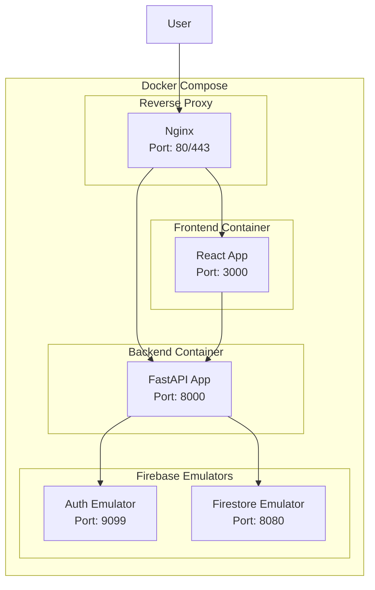

# FastAPI Docker設計書

## 1. 概要

### 1.1 目的
Scoring Bowlards/BowlingアプリケーションのFastAPIバックエンドをDockerコンテナとして構築し、開発・本番環境での一貫した実行環境を提供する。

### 1.2 対象システム
- **バックエンド**: Python FastAPI
- **フロントエンド**: React + Vite
- **データベース**: Firebase Firestore
- **認証**: Firebase Authentication
- **リバースプロキシ**: Nginx
- **コンテナオーケストレーション**: Docker Compose

## 2. Docker構成

### 2.1 全体構成図



### 2.2 サービス構成

| サービス名 | イメージ | ポート | 説明 |
|------------|----------|--------|------|
| nginx | nginx:alpine | 11080:80 | リバースプロキシ |
| frontend | カスタム | 13000:3000 | React開発サーバー |
| backend | カスタム | 18080:8000 | FastAPIアプリケーション |
| firebase-auth | カスタム | 19099:9099 | Firebase認証エミュレータ |
| firebase-firestore | カスタム | 18081:8080 | Firestoreエミュレータ |

## 3. FastAPI Dockerfile設計

### 3.1 マルチステージビルド

```dockerfile
# FastAPI用Dockerfile
FROM python:3.11-slim AS builder

# 作業ディレクトリを設定
WORKDIR /app

# システムパッケージを更新し、必要なパッケージをインストール
RUN apt-get update && apt-get install -y \
    gcc \
    g++ \
    && rm -rf /var/lib/apt/lists/*

# Pythonの依存関係をコピー
COPY backend/requirements.txt .

# 依存関係をインストール
RUN pip install --no-cache-dir --user -r requirements.txt

# 本番用の軽量なイメージ
FROM python:3.11-slim

# 作業ディレクトリを設定
WORKDIR /app

# システムパッケージを更新し、必要なパッケージをインストール
RUN apt-get update && apt-get install -y \
    curl \
    && rm -rf /var/lib/apt/lists/*

# ビルドステージからPythonパッケージをコピー
COPY --from=builder /root/.local /root/.local

# パスを設定
ENV PATH=/root/.local/bin:$PATH

# アプリケーションコードをコピー
COPY backend/ .

# 非rootユーザーを作成
RUN useradd --create-home --shell /bin/bash app \
    && chown -R app:app /app
USER app

# ポートを公開
EXPOSE 8000

# ヘルスチェック
HEALTHCHECK --interval=30s --timeout=30s --start-period=5s --retries=3 \
    CMD curl -f http://localhost:8000/health || exit 1

# アプリケーションを実行
CMD ["uvicorn", "app.main:app", "--host", "0.0.0.0", "--port", "8000"]
```

### 3.2 最適化ポイント

#### 3.2.1 イメージサイズの最適化
- マルチステージビルドによる軽量化
- 不要なパッケージの削除
- キャッシュの活用

#### 3.2.2 セキュリティの向上
- 非rootユーザーでの実行
- 最小権限の原則
- 不要なパッケージの削除

#### 3.2.3 パフォーマンスの向上
- ヘルスチェックの実装
- 適切なポート設定
- リソース制限の設定

## 4. Docker Compose設定

### 4.1 基本設定

```yaml
# docker-compose.fastapi.yml
services:
  nginx:
    image: nginx:alpine
    ports:
      - "11080:80"
      - "11443:443"
    volumes:
      - ./docker/nginx/nginx.conf:/etc/nginx/nginx.conf
      - ./frontend/dist:/usr/share/nginx/html/frontend
    depends_on:
      - frontend
      - backend
    networks:
      - bowlards-network

  frontend:
    build:
      context: ./frontend
      dockerfile: ../docker/frontend/Dockerfile
      target: development
      cache_from:
        - node:20-alpine
    ports:
      - "13000:3000"
    volumes:
      - ./frontend:/app
      - /app/node_modules
    environment:
      - NODE_ENV=development
      - REACT_APP_API_BASE_URL=http://localhost:10080/api/v1
      - REACT_APP_FIREBASE_AUTH_EMULATOR_HOST=localhost
      - REACT_APP_FIREBASE_AUTH_EMULATOR_PORT=19099
    depends_on:
      - backend
    networks:
      - bowlards-network

  backend:
    build:
      context: .
      dockerfile: ./docker/backend/Dockerfile
    ports:
      - "18080:8000"
    volumes:
      - ./backend:/app
      - /app/__pycache__
      - /app/.pytest_cache
    environment:
      - APP_HOST=0.0.0.0
      - APP_PORT=8000
      - APP_DEBUG=true
      - APP_LOG_LEVEL=DEBUG
      - APP_LOG_FORMAT=json
      - FIREBASE_AUTH_EMULATOR_HOST=firebase-auth
      - FIREBASE_AUTH_EMULATOR_PORT=9099
      - FIRESTORE_EMULATOR_HOST=firebase-firestore
      - FIRESTORE_EMULATOR_PORT=8080
      - APP_FIREBASE_PROJECT_ID=bowlards-dev
      - APP_FIREBASE_CREDENTIALS_PATH=/app/credentials.json
    depends_on:
      - firebase-auth
      - firebase-firestore
    networks:
      - bowlards-network

  firebase-auth:
    build:
      context: ./docker/firebase
      dockerfile: Dockerfile
    ports:
      - "19099:9099"
      - "14000:4000"
    volumes:
      - firebase_data:/root/.config/firebase
      - ./docker/firebase/emulator-data:/app/emulator-data
    networks:
      - bowlards-network

  firebase-firestore:
    build:
      context: ./docker/firebase
      dockerfile: Dockerfile
    ports:
      - "18081:8080"
    volumes:
      - firebase_data:/root/.config/firebase
      - ./docker/firebase/emulator-data:/app/emulator-data
    networks:
      - bowlards-network

volumes:
  firebase_data:

networks:
  bowlards-network:
    driver: bridge
```

### 4.2 環境別設定

#### 4.2.1 開発環境
```yaml
# docker-compose.dev.yml
version: '3.8'

services:
  backend:
    build:
      context: .
      dockerfile: ./docker/backend/Dockerfile
      target: development
    volumes:
      - ./backend:/app
      - /app/__pycache__
    environment:
      - APP_DEBUG=true
      - APP_LOG_LEVEL=DEBUG
    command: ["uvicorn", "app.main:app", "--host", "0.0.0.0", "--port", "8000", "--reload"]
```

#### 4.2.2 本番環境
```yaml
# docker-compose.prod.yml
version: '3.8'

services:
  backend:
    build:
      context: .
      dockerfile: ./docker/backend/Dockerfile
      target: production
    environment:
      - APP_DEBUG=false
      - APP_LOG_LEVEL=INFO
    restart: unless-stopped
    deploy:
      resources:
        limits:
          memory: 512M
          cpus: '0.5'
```

## 5. 環境変数設定

### 5.1 環境変数一覧

| 変数名 | 説明 | デフォルト値 | 必須 |
|--------|------|-------------|------|
| APP_HOST | サーバーホスト | 0.0.0.0 | No |
| APP_PORT | サーバーポート | 8000 | No |
| APP_DEBUG | デバッグモード | false | No |
| APP_LOG_LEVEL | ログレベル | INFO | No |
| APP_LOG_FORMAT | ログ形式 | json | No |
| APP_FIREBASE_PROJECT_ID | FirebaseプロジェクトID | - | Yes |
| APP_FIREBASE_CREDENTIALS_PATH | 認証情報ファイルパス | - | No |
| FIRESTORE_EMULATOR_HOST | Firestoreエミュレータホスト | localhost | No |
| FIRESTORE_EMULATOR_PORT | Firestoreエミュレータポート | 8080 | No |
| FIREBASE_AUTH_EMULATOR_HOST | 認証エミュレータホスト | localhost | No |
| FIREBASE_AUTH_EMULATOR_PORT | 認証エミュレータポート | 9099 | No |

### 5.2 環境変数ファイル

```bash
# backend/env.example
# サーバー設定
APP_HOST=0.0.0.0
APP_PORT=8000
APP_DEBUG=false

# Firebase設定
APP_FIREBASE_PROJECT_ID=bowlards-dev
APP_FIREBASE_CREDENTIALS_PATH=./credentials.json

# ログ設定
APP_LOG_LEVEL=INFO
APP_LOG_FORMAT=json

# データベース設定（Firestoreエミュレータ用）
FIRESTORE_EMULATOR_HOST=localhost
FIRESTORE_EMULATOR_PORT=8080

# Firebase認証エミュレータ設定
FIREBASE_AUTH_EMULATOR_HOST=localhost
FIREBASE_AUTH_EMULATOR_PORT=9099

# セキュリティ設定
SECRET_KEY=your-secret-key-here
ALGORITHM=HS256
ACCESS_TOKEN_EXPIRE_MINUTES=30

# CORS設定
ALLOWED_ORIGINS=["http://localhost:3000", "http://localhost:11080"]
ALLOWED_METHODS=["GET", "POST", "PUT", "DELETE", "OPTIONS"]
ALLOWED_HEADERS=["*"]

# レート制限設定
RATE_LIMIT_CALLS=1000
RATE_LIMIT_PERIOD=3600
```

## 6. 依存関係管理

### 6.1 Python依存関係

#### 6.1.1 requirements.txt
```txt
# FastAPI and ASGI server
fastapi==0.104.1
uvicorn[standard]==0.24.0

# Firebase and Google Cloud
firebase-admin==6.2.0
google-cloud-firestore==2.13.1
google-auth==2.23.4

# Authentication and Security
python-jose[cryptography]==3.3.0
python-multipart==0.0.6
passlib[bcrypt]==1.7.4

# Data validation and serialization
pydantic==2.5.0
pydantic-settings==2.1.0
email-validator==2.1.0

# HTTP client
httpx==0.25.2

# Logging and monitoring
structlog==23.2.0
prometheus-client==0.19.0

# Development and testing
pytest==7.4.3
pytest-asyncio==0.21.1
pytest-cov==4.1.0
httpx==0.25.2

# Code quality
black==23.11.0
isort==5.12.0
flake8==6.1.0
mypy==1.7.1

# Environment management
python-dotenv==1.0.0
```

#### 6.1.2 requirements-dev.txt
```txt
# Development dependencies
-r requirements.txt

# Testing
pytest==7.4.3
pytest-asyncio==0.21.1
pytest-cov==4.1.0
pytest-mock==3.12.0
pytest-xdist==3.3.1

# Code quality
black==23.11.0
isort==5.12.0
flake8==6.1.0
mypy==1.7.1
pre-commit==3.6.0

# Documentation
mkdocs==1.5.3
mkdocs-material==9.4.8

# Development tools
ipython==8.17.2
jupyter==1.0.0
```

## 7. ネットワーク設計

### 7.1 ネットワーク構成

```yaml
networks:
  bowlards-network:
    driver: bridge
    ipam:
      config:
        - subnet: 172.20.0.0/16
```

### 7.2 ポートマッピング

| サービス | 内部ポート | 外部ポート | プロトコル |
|----------|------------|------------|------------|
| nginx | 80 | 11080 | HTTP |
| nginx | 443 | 11443 | HTTPS |
| frontend | 3000 | 13000 | HTTP |
| backend | 8000 | 18080 | HTTP |
| firebase-auth | 9099 | 19099 | HTTP |
| firebase-firestore | 8080 | 18081 | HTTP |

## 8. ボリューム設計

### 8.1 ボリューム一覧

| ボリューム名 | 用途 | 永続化 |
|-------------|------|--------|
| firebase_data | Firebaseエミュレータデータ | Yes |
| backend_cache | Pythonキャッシュ | No |
| frontend_node_modules | Node.js依存関係 | No |

### 8.2 ボリューム設定

```yaml
volumes:
  firebase_data:
    driver: local
  backend_cache:
    driver: local
  frontend_node_modules:
    driver: local
```

## 9. ヘルスチェック設計

### 9.1 ヘルスチェック設定

```yaml
services:
  backend:
    healthcheck:
      test: ["CMD", "curl", "-f", "http://localhost:8000/health"]
      interval: 30s
      timeout: 10s
      retries: 3
      start_period: 40s
```

### 9.2 ヘルスチェックエンドポイント

```python
# app/main.py
@app.get("/health")
async def health_check():
    """ヘルスチェックエンドポイント"""
    return {
        "status": "healthy",
        "timestamp": datetime.now().isoformat(),
        "version": "1.0.0"
    }
```

## 10. セキュリティ設計

### 10.1 コンテナセキュリティ

```dockerfile
# 非rootユーザーでの実行
RUN useradd --create-home --shell /bin/bash app \
    && chown -R app:app /app
USER app
```

### 10.2 ネットワークセキュリティ

```yaml
# 内部ネットワークのみでの通信
networks:
  bowlards-network:
    driver: bridge
    internal: false  # 外部アクセス可能
```

### 10.3 リソース制限

```yaml
services:
  backend:
    deploy:
      resources:
        limits:
          memory: 512M
          cpus: '0.5'
        reservations:
          memory: 256M
          cpus: '0.25'
```

## 11. 監視・ログ設計

### 11.1 ログ設定

```yaml
services:
  backend:
    logging:
      driver: "json-file"
      options:
        max-size: "10m"
        max-file: "3"
```

### 11.2 メトリクス収集

```python
# app/utils/metrics.py
from prometheus_client import Counter, Histogram, generate_latest

# メトリクス定義
request_count = Counter('http_requests_total', 'Total HTTP requests', ['method', 'endpoint'])
request_duration = Histogram('http_request_duration_seconds', 'HTTP request duration')

@app.get("/metrics")
async def metrics():
    """Prometheusメトリクスエンドポイント"""
    return Response(generate_latest(), media_type="text/plain")
```

## 12. デプロイメント設計

### 12.1 開発環境デプロイ

```bash
# 開発環境起動
docker-compose -f docker-compose.fastapi.yml up -d

# ログ確認
docker-compose -f docker-compose.fastapi.yml logs -f backend

# サービス停止
docker-compose -f docker-compose.fastapi.yml down
```

### 12.2 本番環境デプロイ

```bash
# 本番環境起動
docker-compose -f docker-compose.fastapi.yml -f docker-compose.prod.yml up -d

# スケールアウト
docker-compose -f docker-compose.fastapi.yml up -d --scale backend=3
```

## 13. トラブルシューティング

### 13.1 よくある問題

#### 13.1.1 ポート競合
```bash
# ポート使用状況確認
netstat -tulpn | grep :8000

# プロセス終了
kill -9 <PID>
```

#### 13.1.2 メモリ不足
```bash
# メモリ使用状況確認
docker stats

# 不要なコンテナ削除
docker system prune -a
```

#### 13.1.3 ネットワーク問題
```bash
# ネットワーク確認
docker network ls
docker network inspect bowlards-network

# ネットワーク再作成
docker-compose down
docker network prune
docker-compose up -d
```

### 13.2 ログ確認

```bash
# 全サービスログ
docker-compose logs -f

# 特定サービスログ
docker-compose logs -f backend

# リアルタイムログ
docker-compose logs -f --tail=100 backend
```

## 14. 変更履歴

| バージョン | 日付 | 変更内容 | 担当者 |
|-----------|------|----------|--------|
| 1.0.0 | 2024-01-01 | FastAPI対応Docker設計書作成 | システムエンジニア |

---

**注意事項**:
- 本設計書はFastAPIとDockerの特性を考慮した設計
- セキュリティ要件の変更時は、必ず設計書を更新すること
- 本番環境では適切なリソース制限と監視設定を行うこと
- 定期的にベースイメージの更新を行うこと
