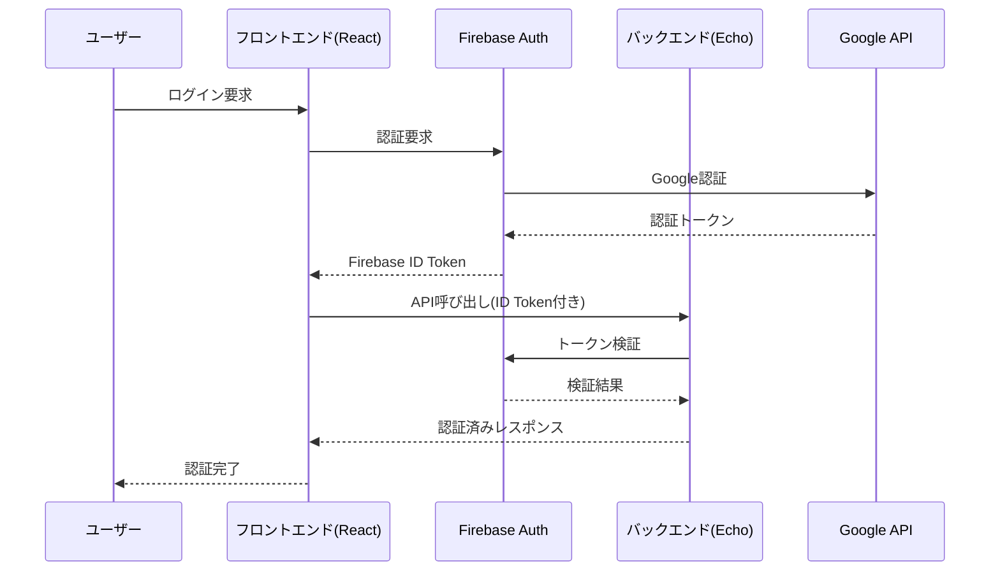

# Firebase認証設計書

## 1. 概要

### 1.1 機能名
Firebase Authentication System

### 1.2 機能の目的
Scoring Bawlards/Bowlingアプリケーションにおいて、ユーザーの認証・認可を管理し、セキュアなアクセス制御を提供する。

### 1.3 対象システム
- **アプリケーション名**: Scoring Bawlards/Bowling
- **フロントエンド**: React + Redux
- **バックエンド**: Echo (Go)
- **認証プロバイダー**: Firebase Authentication
- **クラウドプラットフォーム**: Google Cloud Platform (GCP)

## 2. 認証方式

### 2.1 認証プロバイダー
- **Google認証**: プライマリ認証方式
- **メール/パスワード認証**: セカンダリ認証方式（オプション）

### 2.2 認証フロー


## 3. フロントエンド設計（React）

### 3.1 認証状態管理（Redux）

#### 3.1.1 State構造
```typescript
interface AuthState {
  user: User | null;
  isAuthenticated: boolean;
  isLoading: boolean;
  error: string | null;
}

interface User {
  uid: string;
  email: string;
  displayName: string;
  photoURL: string;
  emailVerified: boolean;
}
```

#### 3.1.2 Actions
- `LOGIN_REQUEST`: ログイン要求
- `LOGIN_SUCCESS`: ログイン成功
- `LOGIN_FAILURE`: ログイン失敗
- `LOGOUT`: ログアウト
- `CLEAR_ERROR`: エラークリア

### 3.2 認証コンポーネント

#### 3.2.1 LoginComponent
```typescript
interface LoginComponentProps {
  onLogin: (user: User) => void;
  onError: (error: string) => void;
}
```

#### 3.2.2 ProtectedRoute
```typescript
interface ProtectedRouteProps {
  children: React.ReactNode;
  fallback?: React.ReactNode;
}
```

### 3.3 Firebase設定
```typescript
const firebaseConfig = {
  apiKey: process.env.REACT_APP_FIREBASE_API_KEY,
  authDomain: process.env.REACT_APP_FIREBASE_AUTH_DOMAIN,
  projectId: process.env.REACT_APP_FIREBASE_PROJECT_ID,
  storageBucket: process.env.REACT_APP_FIREBASE_STORAGE_BUCKET,
  messagingSenderId: process.env.REACT_APP_FIREBASE_MESSAGING_SENDER_ID,
  appId: process.env.REACT_APP_FIREBASE_APP_ID
};
```

## 4. バックエンド設計（Echo）

### 4.1 認証ミドルウェア

#### 4.1.1 Firebase認証ミドルウェア
```go
func FirebaseAuthMiddleware() echo.MiddlewareFunc {
    return func(next echo.HandlerFunc) echo.HandlerFunc {
        return func(c echo.Context) error {
            // Firebase ID Token検証
            token := extractToken(c)
            if token == "" {
                return c.JSON(401, map[string]string{"error": "Unauthorized"})
            }
            
            // Firebase Admin SDKでトークン検証
            decodedToken, err := verifyFirebaseToken(token)
            if err != nil {
                return c.JSON(401, map[string]string{"error": "Invalid token"})
            }
            
            // ユーザー情報をコンテキストに設定
            c.Set("user", decodedToken.Claims)
            return next(c)
        }
    }
}
```

#### 4.1.2 ユーザー情報取得
```go
func GetUserFromContext(c echo.Context) (*firebase.User, error) {
    user := c.Get("user")
    if user == nil {
        return nil, errors.New("user not found in context")
    }
    return user.(*firebase.User), nil
}
```

### 4.2 認証API エンドポイント

#### 4.2.1 ユーザー情報取得
```go
// GET /api/user/profile
func GetUserProfile(c echo.Context) error {
    user, err := GetUserFromContext(c)
    if err != nil {
        return c.JSON(401, map[string]string{"error": "Unauthorized"})
    }
    
    return c.JSON(200, map[string]interface{}{
        "uid": user.UID,
        "email": user.Email,
        "displayName": user.DisplayName,
        "photoURL": user.PhotoURL,
    })
}
```

## 5. セキュリティ対策

### 5.1 トークン管理
- **ID Token有効期限**: 1時間
- **Refresh Token**: 自動更新
- **トークン検証**: バックエンドでFirebase Admin SDKを使用

### 5.2 セキュリティヘッダー
```go
func SecurityHeadersMiddleware() echo.MiddlewareFunc {
    return func(next echo.HandlerFunc) echo.HandlerFunc {
        return func(c echo.Context) error {
            c.Response().Header().Set("X-Content-Type-Options", "nosniff")
            c.Response().Header().Set("X-Frame-Options", "DENY")
            c.Response().Header().Set("X-XSS-Protection", "1; mode=block")
            return next(c)
        }
    }
}
```

### 5.3 レート制限
```go
func RateLimitMiddleware() echo.MiddlewareFunc {
    return func(next echo.HandlerFunc) echo.HandlerFunc {
        return func(c echo.Context) error {
            // レート制限ロジック
            return next(c)
        }
    }
}
```

## 6. データベース設計

### 6.1 ユーザーテーブル
```sql
CREATE TABLE users (
    uid VARCHAR(128) PRIMARY KEY,
    email VARCHAR(255) UNIQUE NOT NULL,
    display_name VARCHAR(255),
    photo_url TEXT,
    created_at TIMESTAMP DEFAULT CURRENT_TIMESTAMP,
    updated_at TIMESTAMP DEFAULT CURRENT_TIMESTAMP ON UPDATE CURRENT_TIMESTAMP
);
```

### 6.2 セッションテーブル
```sql
CREATE TABLE user_sessions (
    id INT AUTO_INCREMENT PRIMARY KEY,
    uid VARCHAR(128) NOT NULL,
    session_token VARCHAR(255) NOT NULL,
    expires_at TIMESTAMP NOT NULL,
    created_at TIMESTAMP DEFAULT CURRENT_TIMESTAMP,
    FOREIGN KEY (uid) REFERENCES users(uid) ON DELETE CASCADE
);
```

## 7. エラーハンドリング

### 7.1 認証エラー
- **401 Unauthorized**: 認証が必要
- **403 Forbidden**: アクセス権限なし
- **429 Too Many Requests**: レート制限超過

### 7.2 エラーレスポンス形式
```json
{
    "error": "error_code",
    "message": "エラーメッセージ",
    "timestamp": "2024-01-01T00:00:00Z"
}
```

## 8. テストケース

### 8.1 フロントエンドテスト
1. **ログイン成功テスト**
   - Google認証が正常に動作する
   - ユーザー情報が正しく取得される
   - Redux stateが正しく更新される

2. **ログイン失敗テスト**
   - 認証エラー時の適切なエラーメッセージ表示
   - ネットワークエラー時のハンドリング

3. **認証状態管理テスト**
   - ページリロード時の認証状態保持
   - トークン期限切れ時の自動更新

### 8.2 バックエンドテスト
1. **認証ミドルウェアテスト**
   - 有効なトークンでの認証成功
   - 無効なトークンでの認証失敗
   - トークンなしでの認証失敗

2. **API認証テスト**
   - 認証が必要なエンドポイントでのアクセス制御
   - 認証済みユーザーでの正常アクセス

## 9. 依存関係

### 9.1 フロントエンド依存関係
```json
{
  "dependencies": {
    "firebase": "^10.0.0",
    "react-redux": "^8.0.0",
    "@reduxjs/toolkit": "^1.9.0"
  }
}
```

### 9.2 バックエンド依存関係
```go
import (
    "firebase.google.com/go/v4"
    "firebase.google.com/go/v4/auth"
    "github.com/labstack/echo/v4"
)
```

## 10. 設定管理

### 10.1 環境変数
```bash
# Firebase設定
FIREBASE_PROJECT_ID=your-project-id
FIREBASE_PRIVATE_KEY=your-private-key
FIREBASE_CLIENT_EMAIL=your-client-email

# フロントエンド
REACT_APP_FIREBASE_API_KEY=your-api-key
REACT_APP_FIREBASE_AUTH_DOMAIN=your-project.firebaseapp.com
REACT_APP_FIREBASE_PROJECT_ID=your-project-id
```

## 11. 監視・ログ

### 11.1 認証ログ
- ログイン成功/失敗
- トークン検証結果
- 異常なアクセスパターン

### 11.2 メトリクス
- 認証成功率
- 平均認証時間
- エラー率

## 12. 変更履歴

| バージョン | 日付 | 変更内容 | 担当者 |
|-----------|------|----------|--------|
| 1.0.0 | 2024-01-01 | 初版作成 | システムエンジニア |

---

**注意事項**:
- 本設計書は定期的にレビューし、最新の状態を保つこと
- セキュリティ要件の変更時は、必ず設計書を更新すること
- 新しい認証プロバイダーの追加時は、本設計書を拡張すること
