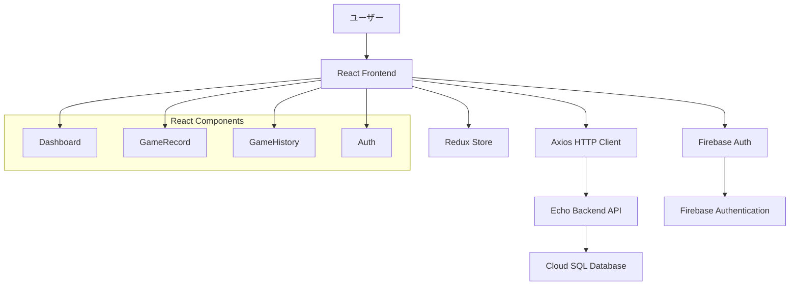

# フロントエンド全体設計書

## 1. 概要

### 1.1 アプリケーション名
Scoring Bawlards/Bowling

### 1.2 機能の目的
ボーリングのスコア記録・管理を行うWebアプリケーションのフロントエンドシステム。ユーザーが個人別にボーリングゲームの記録を作成し、履歴を管理できる機能を提供する。

### 1.3 対象システム
- **フロントエンド**: React + Redux
- **バックエンド**: Echo (Go)
- **認証**: Firebase Authentication
- **クラウドプラットフォーム**: Google Cloud Platform (GCP)
- **データベース**: Cloud SQL (MySQL)

## 2. 技術スタック

### 2.1 フロントエンド技術
- **フレームワーク**: React 18.x
- **状態管理**: Redux Toolkit
- **ルーティング**: React Router v6
- **UIライブラリ**: Material-UI (MUI) v5
- **HTTPクライアント**: Axios
- **認証**: Firebase SDK
- **型定義**: TypeScript
- **ビルドツール**: Vite
- **テスト**: Jest + React Testing Library

### 2.2 開発環境
- **Node.js**: 18.x以上
- **パッケージマネージャー**: npm
- **コードフォーマッター**: Prettier
- **リンター**: ESLint

## 3. アーキテクチャ設計

### 3.1 全体構成図


### 3.2 ディレクトリ構造
```
src/
├── components/          # 再利用可能なコンポーネント
│   ├── common/         # 共通コンポーネント
│   ├── auth/           # 認証関連コンポーネント
│   ├── game/           # ゲーム関連コンポーネント
│   └── layout/         # レイアウトコンポーネント
├── pages/              # ページコンポーネント
│   ├── Dashboard.tsx
│   ├── GameRecord.tsx
│   └── GameHistory.tsx
├── store/              # Redux store
│   ├── index.ts
│   ├── authSlice.ts
│   ├── gameSlice.ts
│   └── historySlice.ts
├── services/           # API呼び出し
│   ├── api.ts
│   ├── authService.ts
│   └── gameService.ts
├── hooks/              # カスタムフック
├── utils/              # ユーティリティ関数
├── types/              # TypeScript型定義
├── constants/          # 定数定義
└── styles/             # スタイル定義
```

## 4. 状態管理設計（Redux）

### 4.1 Store構造
```typescript
interface RootState {
  auth: AuthState;
  game: GameState;
  history: HistoryState;
  ui: UIState;
}

interface AuthState {
  user: User | null;
  isAuthenticated: boolean;
  isLoading: boolean;
  error: string | null;
}

interface GameState {
  currentGame: Game | null;
  isRecording: boolean;
  isLoading: boolean;
  error: string | null;
}

interface HistoryState {
  games: Game[];
  currentPage: number;
  totalPages: number;
  isLoading: boolean;
  error: string | null;
}

interface UIState {
  theme: 'light' | 'dark';
  sidebarOpen: boolean;
  notifications: Notification[];
}
```

### 4.2 主要なSlice設計

#### 4.2.1 AuthSlice
```typescript
const authSlice = createSlice({
  name: 'auth',
  initialState,
  reducers: {
    loginStart: (state) => {
      state.isLoading = true;
      state.error = null;
    },
    loginSuccess: (state, action) => {
      state.user = action.payload;
      state.isAuthenticated = true;
      state.isLoading = false;
    },
    loginFailure: (state, action) => {
      state.error = action.payload;
      state.isLoading = false;
    },
    logout: (state) => {
      state.user = null;
      state.isAuthenticated = false;
    },
    clearError: (state) => {
      state.error = null;
    }
  }
});
```

#### 4.2.2 GameSlice
```typescript
const gameSlice = createSlice({
  name: 'game',
  initialState,
  reducers: {
    startGame: (state, action) => {
      state.currentGame = action.payload;
      state.isRecording = true;
    },
    updateScore: (state, action) => {
      if (state.currentGame) {
        state.currentGame.scores = action.payload;
      }
    },
    finishGame: (state) => {
      state.currentGame = null;
      state.isRecording = false;
    },
    resetGame: (state) => {
      state.currentGame = null;
      state.isRecording = false;
      state.error = null;
    }
  }
});
```

## 5. ルーティング設計

### 5.1 ルート定義
```typescript
const AppRoutes = () => {
  return (
    <BrowserRouter>
      <Routes>
        <Route path="/login" element={<LoginPage />} />
        <Route path="/" element={
          <ProtectedRoute>
            <Layout />
          </ProtectedRoute>
        }>
          <Route index element={<Dashboard />} />
          <Route path="game" element={<GameRecord />} />
          <Route path="history" element={<GameHistory />} />
        </Route>
        <Route path="*" element={<NotFound />} />
      </Routes>
    </BrowserRouter>
  );
};
```

### 5.2 保護されたルート
```typescript
const ProtectedRoute: React.FC<ProtectedRouteProps> = ({ children }) => {
  const { isAuthenticated, isLoading } = useSelector((state: RootState) => state.auth);
  
  if (isLoading) {
    return <LoadingSpinner />;
  }
  
  if (!isAuthenticated) {
    return <Navigate to="/login" replace />;
  }
  
  return <>{children}</>;
};
```

## 6. コンポーネント設計

### 6.1 共通コンポーネント

#### 6.1.1 Layout
```typescript
interface LayoutProps {
  children: React.ReactNode;
}

const Layout: React.FC<LayoutProps> = ({ children }) => {
  return (
    <Box sx={{ display: 'flex' }}>
      <Sidebar />
      <Box component="main" sx={{ flexGrow: 1, p: 3 }}>
        <Header />
        {children}
      </Box>
    </Box>
  );
};
```

#### 6.1.2 LoadingSpinner
```typescript
const LoadingSpinner: React.FC = () => {
  return (
    <Box
      sx={{
        display: 'flex',
        justifyContent: 'center',
        alignItems: 'center',
        height: '100vh'
      }}
    >
      <CircularProgress />
    </Box>
  );
};
```

### 6.2 ページコンポーネント

#### 6.2.1 Dashboard
```typescript
const Dashboard: React.FC = () => {
  const { user } = useSelector((state: RootState) => state.auth);
  const { games } = useSelector((state: RootState) => state.history);
  
  return (
    <Container maxWidth="lg">
      <Typography variant="h4" gutterBottom>
        ようこそ、{user?.displayName}さん
      </Typography>
      <Grid container spacing={3}>
        <Grid item xs={12} md={6}>
          <QuickStats games={games} />
        </Grid>
        <Grid item xs={12} md={6}>
          <RecentGames games={games.slice(0, 5)} />
        </Grid>
      </Grid>
    </Container>
  );
};
```

## 7. API通信設計

### 7.1 APIクライアント設定
```typescript
const apiClient = axios.create({
  baseURL: process.env.REACT_APP_API_BASE_URL,
  timeout: 10000,
  headers: {
    'Content-Type': 'application/json',
  },
});

// リクエストインターセプター
apiClient.interceptors.request.use(
  (config) => {
    const token = getAuthToken();
    if (token) {
      config.headers.Authorization = `Bearer ${token}`;
    }
    return config;
  },
  (error) => Promise.reject(error)
);

// レスポンスインターセプター
apiClient.interceptors.response.use(
  (response) => response,
  (error) => {
    if (error.response?.status === 401) {
      // 認証エラーの場合、ログアウト処理
      store.dispatch(logout());
    }
    return Promise.reject(error);
  }
);
```

### 7.2 サービス層
```typescript
export const gameService = {
  createGame: async (gameData: CreateGameRequest): Promise<Game> => {
    const response = await apiClient.post('/games', gameData);
    return response.data;
  },
  
  getGameHistory: async (page: number = 1): Promise<GameHistoryResponse> => {
    const response = await apiClient.get(`/games/history?page=${page}&limit=10`);
    return response.data;
  },
  
  updateGame: async (gameId: string, gameData: UpdateGameRequest): Promise<Game> => {
    const response = await apiClient.put(`/games/${gameId}`, gameData);
    return response.data;
  },
  
  deleteGame: async (gameId: string): Promise<void> => {
    await apiClient.delete(`/games/${gameId}`);
  }
};
```

## 8. エラーハンドリング

### 8.1 エラー境界
```typescript
class ErrorBoundary extends React.Component<ErrorBoundaryProps, ErrorBoundaryState> {
  constructor(props: ErrorBoundaryProps) {
    super(props);
    this.state = { hasError: false, error: null };
  }
  
  static getDerivedStateFromError(error: Error): ErrorBoundaryState {
    return { hasError: true, error };
  }
  
  componentDidCatch(error: Error, errorInfo: React.ErrorInfo) {
    console.error('Error caught by boundary:', error, errorInfo);
    // エラーログ送信
  }
  
  render() {
    if (this.state.hasError) {
      return <ErrorFallback error={this.state.error} />;
    }
    
    return this.props.children;
  }
}
```

### 8.2 グローバルエラーハンドリング
```typescript
const GlobalErrorHandler: React.FC = () => {
  const dispatch = useDispatch();
  
  useEffect(() => {
    const handleError = (event: ErrorEvent) => {
      dispatch(addNotification({
        type: 'error',
        message: '予期しないエラーが発生しました',
        timestamp: new Date().toISOString()
      }));
    };
    
    window.addEventListener('error', handleError);
    return () => window.removeEventListener('error', handleError);
  }, [dispatch]);
  
  return null;
};
```

## 9. パフォーマンス最適化

### 9.1 コード分割
```typescript
const Dashboard = lazy(() => import('./pages/Dashboard'));
const GameRecord = lazy(() => import('./pages/GameRecord'));
const GameHistory = lazy(() => import('./pages/GameHistory'));

const AppRoutes = () => {
  return (
    <Suspense fallback={<LoadingSpinner />}>
      <Routes>
        <Route path="/" element={<Dashboard />} />
        <Route path="/game" element={<GameRecord />} />
        <Route path="/history" element={<GameHistory />} />
      </Routes>
    </Suspense>
  );
};
```

### 9.2 メモ化
```typescript
const GameScoreCard = React.memo<GameScoreCardProps>(({ game, onUpdate }) => {
  const handleScoreUpdate = useCallback((frame: number, score: number) => {
    onUpdate(game.id, frame, score);
  }, [game.id, onUpdate]);
  
  return (
    <Card>
      {/* コンポーネント内容 */}
    </Card>
  );
});
```

## 10. セキュリティ対策

### 10.1 認証トークン管理
```typescript
const tokenManager = {
  getToken: (): string | null => {
    return localStorage.getItem('auth_token');
  },
  
  setToken: (token: string): void => {
    localStorage.setItem('auth_token', token);
  },
  
  removeToken: (): void => {
    localStorage.removeItem('auth_token');
  },
  
  isTokenValid: (token: string): boolean => {
    try {
      const payload = JSON.parse(atob(token.split('.')[1]));
      return payload.exp * 1000 > Date.now();
    } catch {
      return false;
    }
  }
};
```

### 10.2 XSS対策
```typescript
const sanitizeInput = (input: string): string => {
  return input
    .replace(/</g, '&lt;')
    .replace(/>/g, '&gt;')
    .replace(/"/g, '&quot;')
    .replace(/'/g, '&#x27;')
    .replace(/\//g, '&#x2F;');
};
```

## 11. テスト戦略

### 11.1 単体テスト
```typescript
describe('GameSlice', () => {
  it('should handle startGame action', () => {
    const initialState = { currentGame: null, isRecording: false };
    const newGame = { id: '1', scores: [], createdAt: new Date() };
    
    const newState = gameSlice.reducer(initialState, startGame(newGame));
    
    expect(newState.currentGame).toEqual(newGame);
    expect(newState.isRecording).toBe(true);
  });
});
```

### 11.2 統合テスト
```typescript
describe('GameRecord Component', () => {
  it('should create a new game when start button is clicked', async () => {
    render(<GameRecord />);
    
    const startButton = screen.getByText('ゲーム開始');
    fireEvent.click(startButton);
    
    await waitFor(() => {
      expect(mockGameService.createGame).toHaveBeenCalled();
    });
  });
});
```

## 12. 依存関係

### 12.1 主要な依存関係
```json
{
  "dependencies": {
    "react": "^18.2.0",
    "react-dom": "^18.2.0",
    "react-router-dom": "^6.8.0",
    "@reduxjs/toolkit": "^1.9.0",
    "react-redux": "^8.0.0",
    "@mui/material": "^5.11.0",
    "@mui/icons-material": "^5.11.0",
    "@emotion/react": "^11.10.0",
    "@emotion/styled": "^11.10.0",
    "axios": "^1.3.0",
    "firebase": "^10.0.0",
    "typescript": "^4.9.0"
  },
  "devDependencies": {
    "@vitejs/plugin-react": "^3.1.0",
    "vite": "^4.1.0",
    "@types/react": "^18.0.0",
    "@types/react-dom": "^18.0.0",
    "eslint": "^8.34.0",
    "prettier": "^2.8.0",
    "jest": "^29.3.0",
    "@testing-library/react": "^13.4.0",
    "@testing-library/jest-dom": "^5.16.0"
  }
}
```

## 13. 設定管理

### 13.1 環境変数
```bash
# API設定
REACT_APP_API_BASE_URL=https://api.bowlards.com
REACT_APP_API_TIMEOUT=10000

# Firebase設定
REACT_APP_FIREBASE_API_KEY=your-api-key
REACT_APP_FIREBASE_AUTH_DOMAIN=your-project.firebaseapp.com
REACT_APP_FIREBASE_PROJECT_ID=your-project-id
REACT_APP_FIREBASE_STORAGE_BUCKET=your-project.appspot.com
REACT_APP_FIREBASE_MESSAGING_SENDER_ID=your-sender-id
REACT_APP_FIREBASE_APP_ID=your-app-id

# アプリケーション設定
REACT_APP_APP_NAME=Scoring Bawlards
REACT_APP_VERSION=1.0.0
REACT_APP_ENVIRONMENT=production
```

### 13.2 Vite設定
```typescript
import { defineConfig } from 'vite';
import react from '@vitejs/plugin-react';

export default defineConfig({
  plugins: [react()],
  server: {
    port: 3000,
    proxy: {
      '/api': {
        target: 'http://localhost:8080',
        changeOrigin: true,
      },
    },
  },
  build: {
    outDir: 'dist',
    sourcemap: true,
  },
});
```

## 14. デプロイメント

### 14.1 ビルドプロセス
```json
{
  "scripts": {
    "dev": "vite",
    "build": "tsc && vite build",
    "preview": "vite preview",
    "test": "jest",
    "test:coverage": "jest --coverage",
    "lint": "eslint src --ext ts,tsx",
    "lint:fix": "eslint src --ext ts,tsx --fix",
    "format": "prettier --write src/**/*.{ts,tsx}"
  }
}
```

### 14.2 Docker設定
```dockerfile
FROM node:18-alpine as build
WORKDIR /app
COPY package*.json ./
RUN npm ci --only=production
COPY . .
RUN npm run build

FROM nginx:alpine
COPY --from=build /app/dist /usr/share/nginx/html
COPY nginx.conf /etc/nginx/nginx.conf
EXPOSE 80
CMD ["nginx", "-g", "daemon off;"]
```

## 15. 監視・ログ

### 15.1 エラートラッキング
```typescript
import * as Sentry from '@sentry/react';

Sentry.init({
  dsn: process.env.REACT_APP_SENTRY_DSN,
  environment: process.env.REACT_APP_ENVIRONMENT,
});

const App = () => {
  return (
    <Sentry.ErrorBoundary fallback={ErrorFallback}>
      <Router>
        <Routes>
          {/* ルート定義 */}
        </Routes>
      </Router>
    </Sentry.ErrorBoundary>
  );
};
```

### 15.2 パフォーマンス監視
```typescript
import { getCLS, getFID, getFCP, getLCP, getTTFB } from 'web-vitals';

const sendToAnalytics = (metric: any) => {
  // パフォーマンスメトリクスを送信
  console.log(metric);
};

getCLS(sendToAnalytics);
getFID(sendToAnalytics);
getFCP(sendToAnalytics);
getLCP(sendToAnalytics);
getTTFB(sendToAnalytics);
```

## 16. 変更履歴

| バージョン | 日付 | 変更内容 | 担当者 |
|-----------|------|----------|--------|
| 1.0.0 | 2024-01-01 | 初版作成 | システムエンジニア |

---

**注意事項**:
- 本設計書は定期的にレビューし、最新の状態を保つこと
- 新しい機能追加時は、必ず設計書を更新すること
- パフォーマンス要件の変更時は、最適化戦略を見直すこと
