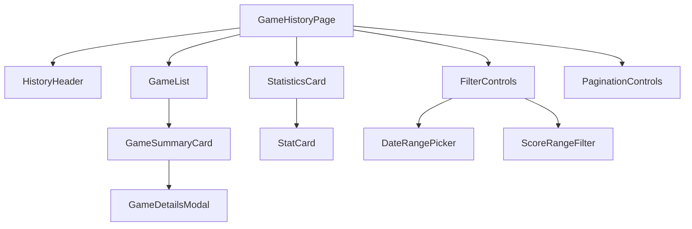

# ボーラードゲーム記録履歴機能設計書

## 1. 概要

### 1.1 機能名
ボーラードゲーム記録履歴機能

### 1.2 機能の目的
ユーザーが過去にプレイしたボーリングゲームの履歴を表示し、統計情報や詳細なスコア分析を提供する機能。

### 1.3 対象システム
- **アプリケーション名**: Scoring Bawlards/Bowling
- **フロントエンド**: React + Redux
- **バックエンド**: Echo (Go)
- **認証**: Firebase Authentication
- **データ保存**: Cloud SQL (MySQL)

## 2. 機能仕様

### 2.1 主要機能
1. **履歴一覧表示**: 過去のゲーム履歴をページングで表示
2. **詳細表示**: 個別ゲームの詳細スコア表示
3. **統計情報**: 平均スコア、最高スコア、ゲーム数などの統計
4. **検索・フィルタ**: 日付範囲やスコア範囲での絞り込み
5. **データ削除**: 不要なゲーム記録の削除

### 2.2 表示制限
- **1ページあたり**: 最大10件
- **保存期間**: 3ヶ月
- **ページング**: 前後ページナビゲーション

## 3. データ構造設計

### 3.1 履歴データ構造
```typescript
interface GameHistory {
  games: Game[];
  pagination: Pagination;
  statistics: GameStatistics;
}

interface Pagination {
  currentPage: number;
  totalPages: number;
  totalItems: number;
  itemsPerPage: number;
  hasNextPage: boolean;
  hasPreviousPage: boolean;
}

interface GameStatistics {
  totalGames: number;
  averageScore: number;
  highestScore: number;
  lowestScore: number;
  totalStrikes: number;
  totalSpares: number;
  gamesThisMonth: number;
  improvementRate: number;
}

interface GameSummary {
  id: string;
  gameDate: string;
  totalScore: number;
  strikes: number;
  spares: number;
  status: 'completed' | 'in_progress';
  duration?: number; // ゲーム時間（分）
}
```

## 4. フロントエンド設計

### 4.1 コンポーネント構成


### 4.2 主要コンポーネント

#### 4.2.1 GameHistoryPage
```typescript
const GameHistoryPage: React.FC = () => {
  const dispatch = useDispatch();
  const { games, pagination, statistics, isLoading, error } = useSelector(
    (state: RootState) => state.history
  );
  const { user } = useSelector((state: RootState) => state.auth);
  
  const [filters, setFilters] = useState<HistoryFilters>({
    dateFrom: null,
    dateTo: null,
    minScore: null,
    maxScore: null,
  });
  
  useEffect(() => {
    if (user) {
      dispatch(loadGameHistory({ userId: user.uid, page: 1, filters }));
    }
  }, [dispatch, user, filters]);
  
  const handlePageChange = (page: number) => {
    if (user) {
      dispatch(loadGameHistory({ userId: user.uid, page, filters }));
    }
  };
  
  const handleFilterChange = (newFilters: HistoryFilters) => {
    setFilters(newFilters);
  };
  
  const handleDeleteGame = (gameId: string) => {
    dispatch(deleteGame(gameId));
  };
  
  return (
    <Container maxWidth="lg">
      <HistoryHeader />
      
      <StatisticsCard statistics={statistics} />
      
      <FilterControls 
        filters={filters}
        onFilterChange={handleFilterChange}
      />
      
      <GameList 
        games={games}
        onDeleteGame={handleDeleteGame}
        isLoading={isLoading}
      />
      
      <PaginationControls 
        pagination={pagination}
        onPageChange={handlePageChange}
      />
    </Container>
  );
};
```

#### 4.2.2 StatisticsCard
```typescript
interface StatisticsCardProps {
  statistics: GameStatistics;
}

const StatisticsCard: React.FC<StatisticsCardProps> = ({ statistics }) => {
  return (
    <Paper sx={{ p: 3, mb: 3 }}>
      <Typography variant="h6" gutterBottom>
        統計情報
      </Typography>
      
      <Grid container spacing={3}>
        <Grid item xs={6} md={3}>
          <StatCard
            title="総ゲーム数"
            value={statistics.totalGames}
            icon={<SportsIcon />}
          />
        </Grid>
        <Grid item xs={6} md={3}>
          <StatCard
            title="平均スコア"
            value={Math.round(statistics.averageScore)}
            icon={<TrendingUpIcon />}
          />
        </Grid>
        <Grid item xs={6} md={3}>
          <StatCard
            title="最高スコア"
            value={statistics.highestScore}
            icon={<EmojiEventsIcon />}
          />
        </Grid>
        <Grid item xs={6} md={3}>
          <StatCard
            title="今月のゲーム数"
            value={statistics.gamesThisMonth}
            icon={<CalendarMonthIcon />}
          />
        </Grid>
      </Grid>
    </Paper>
  );
};
```

#### 4.2.3 GameList
```typescript
interface GameListProps {
  games: GameSummary[];
  onDeleteGame: (gameId: string) => void;
  isLoading: boolean;
}

const GameList: React.FC<GameListProps> = ({ games, onDeleteGame, isLoading }) => {
  const [selectedGame, setSelectedGame] = useState<Game | null>(null);
  
  if (isLoading) {
    return <LoadingSpinner />;
  }
  
  if (games.length === 0) {
    return (
      <Paper sx={{ p: 4, textAlign: 'center' }}>
        <Typography variant="h6" color="text.secondary">
          ゲーム履歴がありません
        </Typography>
        <Typography variant="body2" color="text.secondary" sx={{ mt: 1 }}>
          新しいゲームを開始して記録を残しましょう
        </Typography>
      </Paper>
    );
  }
  
  return (
    <>
      <Paper sx={{ p: 2 }}>
        {games.map((game) => (
          <GameSummaryCard
            key={game.id}
            game={game}
            onViewDetails={() => setSelectedGame(game as Game)}
            onDelete={() => onDeleteGame(game.id)}
          />
        ))}
      </Paper>
      
      {selectedGame && (
        <GameDetailsModal
          game={selectedGame}
          open={!!selectedGame}
          onClose={() => setSelectedGame(null)}
        />
      )}
    </>
  );
};
```

#### 4.2.4 GameSummaryCard
```typescript
interface GameSummaryCardProps {
  game: GameSummary;
  onViewDetails: () => void;
  onDelete: () => void;
}

const GameSummaryCard: React.FC<GameSummaryCardProps> = ({ 
  game, 
  onViewDetails, 
  onDelete 
}) => {
  return (
    <Card sx={{ mb: 2, p: 2 }}>
      <Grid container alignItems="center" spacing={2}>
        <Grid item xs={12} md={3}>
          <Typography variant="body2" color="text.secondary">
            {format(new Date(game.gameDate), 'yyyy/MM/dd HH:mm')}
          </Typography>
        </Grid>
        
        <Grid item xs={12} md={2}>
          <Typography variant="h6" color="primary">
            {game.totalScore}点
          </Typography>
        </Grid>
        
        <Grid item xs={12} md={2}>
          <Box sx={{ display: 'flex', gap: 1 }}>
            <Chip 
              label={`ストライク ${game.strikes}`}
              size="small"
              color="primary"
              variant="outlined"
            />
            <Chip 
              label={`スペア ${game.spares}`}
              size="small"
              color="secondary"
              variant="outlined"
            />
          </Box>
        </Grid>
        
        <Grid item xs={12} md={2}>
          <Chip
            label={game.status === 'completed' ? '完了' : '進行中'}
            color={game.status === 'completed' ? 'success' : 'warning'}
            size="small"
          />
        </Grid>
        
        <Grid item xs={12} md={3}>
          <Box sx={{ display: 'flex', gap: 1 }}>
            <Button
              size="small"
              variant="outlined"
              onClick={onViewDetails}
            >
              詳細
            </Button>
            <Button
              size="small"
              color="error"
              variant="outlined"
              onClick={onDelete}
            >
              削除
            </Button>
          </Box>
        </Grid>
      </Grid>
    </Card>
  );
};
```

## 5. Redux State管理

### 5.1 HistorySlice
```typescript
interface HistoryState {
  games: GameSummary[];
  pagination: Pagination;
  statistics: GameStatistics;
  filters: HistoryFilters;
  isLoading: boolean;
  error: string | null;
}

const historySlice = createSlice({
  name: 'history',
  initialState: {
    games: [],
    pagination: {
      currentPage: 1,
      totalPages: 0,
      totalItems: 0,
      itemsPerPage: 10,
      hasNextPage: false,
      hasPreviousPage: false,
    },
    statistics: {
      totalGames: 0,
      averageScore: 0,
      highestScore: 0,
      lowestScore: 0,
      totalStrikes: 0,
      totalSpares: 0,
      gamesThisMonth: 0,
      improvementRate: 0,
    },
    filters: {
      dateFrom: null,
      dateTo: null,
      minScore: null,
      maxScore: null,
    },
    isLoading: false,
    error: null,
  } as HistoryState,
  reducers: {
    setLoading: (state, action: PayloadAction<boolean>) => {
      state.isLoading = action.payload;
    },
    setError: (state, action: PayloadAction<string>) => {
      state.error = action.payload;
    },
    setFilters: (state, action: PayloadAction<HistoryFilters>) => {
      state.filters = action.payload;
    },
    clearError: (state) => {
      state.error = null;
    },
  },
  extraReducers: (builder) => {
    builder
      .addCase(loadGameHistory.pending, (state) => {
        state.isLoading = true;
        state.error = null;
      })
      .addCase(loadGameHistory.fulfilled, (state, action) => {
        state.isLoading = false;
        state.games = action.payload.games;
        state.pagination = action.payload.pagination;
        state.statistics = action.payload.statistics;
      })
      .addCase(loadGameHistory.rejected, (state, action) => {
        state.isLoading = false;
        state.error = action.payload as string;
      })
      .addCase(deleteGame.fulfilled, (state, action) => {
        state.games = state.games.filter(game => game.id !== action.payload);
        state.statistics.totalGames -= 1;
      });
  },
});
```

### 5.2 非同期アクション
```typescript
export const loadGameHistory = createAsyncThunk(
  'history/loadGameHistory',
  async (params: LoadHistoryParams, { rejectWithValue }) => {
    try {
      const response = await historyService.getGameHistory(params);
      return response.data;
    } catch (error) {
      return rejectWithValue(error.message);
    }
  }
);

export const deleteGame = createAsyncThunk(
  'history/deleteGame',
  async (gameId: string, { rejectWithValue }) => {
    try {
      await historyService.deleteGame(gameId);
      return gameId;
    } catch (error) {
      return rejectWithValue(error.message);
    }
  }
);
```

## 6. API設計

### 6.1 履歴取得API
```typescript
// GET /api/games/history
interface LoadHistoryParams {
  userId: string;
  page: number;
  limit?: number;
  filters?: HistoryFilters;
}

interface HistoryResponse {
  games: GameSummary[];
  pagination: Pagination;
  statistics: GameStatistics;
}

// DELETE /api/games/:id
interface DeleteGameResponse {
  message: string;
}
```

### 6.2 サービス層実装
```typescript
export const historyService = {
  getGameHistory: async (params: LoadHistoryParams): Promise<HistoryResponse> => {
    const queryParams = new URLSearchParams({
      page: params.page.toString(),
      limit: (params.limit || 10).toString(),
    });
    
    if (params.filters) {
      if (params.filters.dateFrom) {
        queryParams.append('dateFrom', params.filters.dateFrom);
      }
      if (params.filters.dateTo) {
        queryParams.append('dateTo', params.filters.dateTo);
      }
      if (params.filters.minScore) {
        queryParams.append('minScore', params.filters.minScore.toString());
      }
      if (params.filters.maxScore) {
        queryParams.append('maxScore', params.filters.maxScore.toString());
      }
    }
    
    const response = await apiClient.get(
      `/games/history?${queryParams.toString()}`
    );
    return response.data;
  },
  
  deleteGame: async (gameId: string): Promise<DeleteGameResponse> => {
    const response = await apiClient.delete(`/games/${gameId}`);
    return response.data;
  },
  
  getGameStatistics: async (userId: string): Promise<GameStatistics> => {
    const response = await apiClient.get(`/games/statistics/${userId}`);
    return response.data;
  },
};
```

## 7. フィルタリング機能

### 7.1 フィルターコンポーネント
```typescript
interface FilterControlsProps {
  filters: HistoryFilters;
  onFilterChange: (filters: HistoryFilters) => void;
}

const FilterControls: React.FC<FilterControlsProps> = ({ 
  filters, 
  onFilterChange 
}) => {
  const handleDateRangeChange = (dateFrom: Date | null, dateTo: Date | null) => {
    onFilterChange({
      ...filters,
      dateFrom: dateFrom?.toISOString() || null,
      dateTo: dateTo?.toISOString() || null,
    });
  };
  
  const handleScoreRangeChange = (minScore: number | null, maxScore: number | null) => {
    onFilterChange({
      ...filters,
      minScore,
      maxScore,
    });
  };
  
  const handleClearFilters = () => {
    onFilterChange({
      dateFrom: null,
      dateTo: null,
      minScore: null,
      maxScore: null,
    });
  };
  
  return (
    <Paper sx={{ p: 2, mb: 3 }}>
      <Typography variant="h6" gutterBottom>
        フィルター
      </Typography>
      
      <Grid container spacing={2} alignItems="center">
        <Grid item xs={12} md={3}>
          <DateRangePicker
            startDate={filters.dateFrom ? new Date(filters.dateFrom) : null}
            endDate={filters.dateTo ? new Date(filters.dateTo) : null}
            onChange={handleDateRangeChange}
          />
        </Grid>
        
        <Grid item xs={12} md={3}>
          <ScoreRangeFilter
            minScore={filters.minScore}
            maxScore={filters.maxScore}
            onChange={handleScoreRangeChange}
          />
        </Grid>
        
        <Grid item xs={12} md={3}>
          <Button
            variant="outlined"
            onClick={handleClearFilters}
            startIcon={<ClearIcon />}
          >
            フィルタークリア
          </Button>
        </Grid>
      </Grid>
    </Paper>
  );
};
```

## 8. ページング機能

### 8.1 ページングコンポーネント
```typescript
interface PaginationControlsProps {
  pagination: Pagination;
  onPageChange: (page: number) => void;
}

const PaginationControls: React.FC<PaginationControlsProps> = ({ 
  pagination, 
  onPageChange 
}) => {
  const handlePreviousPage = () => {
    if (pagination.hasPreviousPage) {
      onPageChange(pagination.currentPage - 1);
    }
  };
  
  const handleNextPage = () => {
    if (pagination.hasNextPage) {
      onPageChange(pagination.currentPage + 1);
    }
  };
  
  return (
    <Box sx={{ display: 'flex', justifyContent: 'center', mt: 3 }}>
      <Pagination
        count={pagination.totalPages}
        page={pagination.currentPage}
        onChange={(_, page) => onPageChange(page)}
        color="primary"
        showFirstButton
        showLastButton
      />
    </Box>
  );
};
```

## 9. 統計計算

### 9.1 統計情報計算
```typescript
const calculateStatistics = (games: Game[]): GameStatistics => {
  if (games.length === 0) {
    return {
      totalGames: 0,
      averageScore: 0,
      highestScore: 0,
      lowestScore: 0,
      totalStrikes: 0,
      totalSpares: 0,
      gamesThisMonth: 0,
      improvementRate: 0,
    };
  }
  
  const completedGames = games.filter(game => game.status === 'completed');
  const scores = completedGames.map(game => game.totalScore);
  const thisMonth = new Date();
  thisMonth.setDate(1);
  
  const gamesThisMonth = completedGames.filter(game => 
    new Date(game.gameDate) >= thisMonth
  ).length;
  
  const totalStrikes = completedGames.reduce((total, game) => 
    total + game.frames.filter(frame => frame.isStrike).length, 0
  );
  
  const totalSpares = completedGames.reduce((total, game) => 
    total + game.frames.filter(frame => frame.isSpare).length, 0
  );
  
  const averageScore = scores.reduce((sum, score) => sum + score, 0) / scores.length;
  const highestScore = Math.max(...scores);
  const lowestScore = Math.min(...scores);
  
  // 改善率の計算（過去30日とその前30日を比較）
  const improvementRate = calculateImprovementRate(completedGames);
  
  return {
    totalGames: completedGames.length,
    averageScore,
    highestScore,
    lowestScore,
    totalStrikes,
    totalSpares,
    gamesThisMonth,
    improvementRate,
  };
};
```

## 10. テストケース

### 10.1 単体テスト
```typescript
describe('Game History', () => {
  it('should calculate statistics correctly', () => {
    const games: Game[] = [
      {
        id: '1',
        userId: 'user1',
        gameDate: '2024-01-01',
        totalScore: 150,
        frames: [],
        status: 'completed',
        createdAt: '2024-01-01',
        updatedAt: '2024-01-01',
      },
      {
        id: '2',
        userId: 'user1',
        gameDate: '2024-01-02',
        totalScore: 200,
        frames: [],
        status: 'completed',
        createdAt: '2024-01-02',
        updatedAt: '2024-01-02',
      },
    ];
    
    const statistics = calculateStatistics(games);
    
    expect(statistics.totalGames).toBe(2);
    expect(statistics.averageScore).toBe(175);
    expect(statistics.highestScore).toBe(200);
    expect(statistics.lowestScore).toBe(150);
  });
});
```

## 11. 変更履歴

| バージョン | 日付 | 変更内容 | 担当者 |
|-----------|------|----------|--------|
| 1.0.0 | 2024-01-01 | 初版作成 | システムエンジニア |

---

**注意事項**:
- 履歴データの保存期間（3ヶ月）を超えたデータは自動削除されること
- ページング機能は必ず10件ずつ表示すること
- 統計情報はリアルタイムで更新されること
