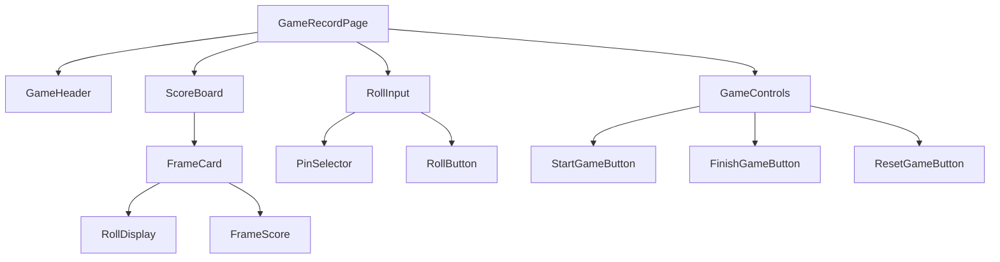

# ボーラードゲーム記録作成機能設計書

## 1. 概要

### 1.1 機能名
ボーラードゲーム記録作成機能

### 1.2 機能の目的
ユーザーがボーリングゲームのスコアをリアルタイムで記録し、ゲーム終了時に自動的にスコア計算と保存を行う機能を提供する。

### 1.3 対象システム
- **アプリケーション名**: Scoring Bawlards/Bowling
- **フロントエンド**: React + Redux
- **バックエンド**: Echo (Go)
- **認証**: Firebase Authentication
- **データ保存**: Cloud SQL (MySQL)

## 2. 機能仕様

### 2.1 主要機能
1. **ゲーム開始**: 新しいボーリングゲームの開始
2. **スコア入力**: フレームごとのピン倒し数の入力
3. **スコア計算**: ボーリングルールに基づく自動スコア計算
4. **ゲーム保存**: 完了したゲームのデータベース保存
5. **リアルタイム更新**: 入力に応じたスコア表示の即座更新

### 2.2 ボーリングルール
- **フレーム数**: 10フレーム
- **1~9フレーム目**: 最大2投（ストライクの場合は1投）
- **10フレーム目**: ストライク・スペアの場合は最大3投
- **ストライク**: 1投目で10本すべて倒す
- **スペア**: 2投目で残りのピンをすべて倒す

## 3. データ構造設計

### 3.1 ゲームデータ構造
```typescript
interface Game {
  id: string;
  userId: string;
  gameDate: string;
  totalScore: number;
  frames: Frame[];
  status: 'in_progress' | 'completed';
  createdAt: string;
  updatedAt: string;
}

interface Frame {
  frameNumber: number; // 1-10
  firstRoll: number | null; // 0-10
  secondRoll: number | null; // 0-10 (ストライクの場合はnull)
  thirdRoll: number | null; // 10フレーム目のみ、0-10
  frameScore: number | null; // 計算されたフレームスコア
  isStrike: boolean;
  isSpare: boolean;
  isCompleted: boolean;
}

interface RollInput {
  frameNumber: number;
  rollNumber: 1 | 2 | 3;
  pins: number;
}
```

### 3.2 スコア計算ロジック
```typescript
interface ScoreCalculation {
  calculateFrameScore: (frame: Frame, nextFrames: Frame[]) => number;
  calculateTotalScore: (frames: Frame[]) => number;
  isStrike: (firstRoll: number) => boolean;
  isSpare: (firstRoll: number, secondRoll: number) => boolean;
  getStrikeBonus: (nextFrames: Frame[]) => number;
  getSpareBonus: (nextFrame: Frame) => number;
}
```

## 4. フロントエンド設計

### 4.1 コンポーネント構成


### 4.2 主要コンポーネント

#### 4.2.1 GameRecordPage
```typescript
interface GameRecordPageProps {}

const GameRecordPage: React.FC<GameRecordPageProps> = () => {
  const dispatch = useDispatch();
  const { currentGame, isRecording, isLoading } = useSelector((state: RootState) => state.game);
  const { user } = useSelector((state: RootState) => state.auth);
  
  const handleStartGame = useCallback(() => {
    if (user) {
      dispatch(startNewGame(user.uid));
    }
  }, [dispatch, user]);
  
  const handleRollInput = useCallback((frameNumber: number, rollNumber: 1 | 2 | 3, pins: number) => {
    if (currentGame) {
      dispatch(updateRoll({ frameNumber, rollNumber, pins }));
    }
  }, [dispatch, currentGame]);
  
  const handleFinishGame = useCallback(() => {
    if (currentGame) {
      dispatch(finishGame(currentGame.id));
    }
  }, [dispatch, currentGame]);
  
  return (
    <Container maxWidth="lg">
      <GameHeader 
        game={currentGame}
        isRecording={isRecording}
      />
      
      <ScoreBoard 
        frames={currentGame?.frames || []}
        totalScore={currentGame?.totalScore || 0}
      />
      
      <RollInput 
        currentFrame={getCurrentFrame(currentGame?.frames)}
        onRollInput={handleRollInput}
        disabled={!isRecording}
      />
      
      <GameControls 
        isRecording={isRecording}
        onStartGame={handleStartGame}
        onFinishGame={handleFinishGame}
        canFinish={canFinishGame(currentGame?.frames)}
      />
    </Container>
  );
};
```

#### 4.2.2 ScoreBoard
```typescript
interface ScoreBoardProps {
  frames: Frame[];
  totalScore: number;
}

const ScoreBoard: React.FC<ScoreBoardProps> = ({ frames, totalScore }) => {
  return (
    <Paper sx={{ p: 2, mb: 3 }}>
      <Typography variant="h6" gutterBottom>
        スコアボード
      </Typography>
      
      <Grid container spacing={1}>
        {frames.map((frame, index) => (
          <Grid item xs={1.2} key={frame.frameNumber}>
            <FrameCard 
              frame={frame}
              isCurrentFrame={index === getCurrentFrameIndex(frames)}
            />
          </Grid>
        ))}
        
        <Grid item xs={1.2}>
          <TotalScoreCard totalScore={totalScore} />
        </Grid>
      </Grid>
    </Paper>
  );
};
```

#### 4.2.3 FrameCard
```typescript
interface FrameCardProps {
  frame: Frame;
  isCurrentFrame: boolean;
}

const FrameCard: React.FC<FrameCardProps> = ({ frame, isCurrentFrame }) => {
  return (
    <Card 
      sx={{ 
        p: 1, 
        textAlign: 'center',
        border: isCurrentFrame ? 2 : 1,
        borderColor: isCurrentFrame ? 'primary.main' : 'divider'
      }}
    >
      <Typography variant="caption" color="text.secondary">
        {frame.frameNumber}
      </Typography>
      
      <Box sx={{ display: 'flex', justifyContent: 'space-between', mb: 0.5 }}>
        <RollDisplay 
          value={frame.firstRoll}
          isStrike={frame.isStrike}
        />
        <RollDisplay 
          value={frame.secondRoll}
          isSpare={frame.isSpare && !frame.isStrike}
        />
        {frame.frameNumber === 10 && (
          <RollDisplay 
            value={frame.thirdRoll}
          />
        )}
      </Box>
      
      <Typography variant="body2" fontWeight="bold">
        {frame.frameScore !== null ? frame.frameScore : ''}
      </Typography>
    </Card>
  );
};
```

#### 4.2.4 RollInput
```typescript
interface RollInputProps {
  currentFrame: Frame | null;
  onRollInput: (frameNumber: number, rollNumber: 1 | 2 | 3, pins: number) => void;
  disabled: boolean;
}

const RollInput: React.FC<RollInputProps> = ({ currentFrame, onRollInput, disabled }) => {
  const [selectedPins, setSelectedPins] = useState<number>(0);
  
  const handlePinSelect = (pins: number) => {
    setSelectedPins(pins);
  };
  
  const handleRollSubmit = () => {
    if (currentFrame && selectedPins >= 0) {
      const rollNumber = getNextRollNumber(currentFrame);
      onRollInput(currentFrame.frameNumber, rollNumber, selectedPins);
      setSelectedPins(0);
    }
  };
  
  if (!currentFrame) {
    return (
      <Paper sx={{ p: 2, textAlign: 'center' }}>
        <Typography>ゲームを開始してください</Typography>
      </Paper>
    );
  }
  
  return (
    <Paper sx={{ p: 2 }}>
      <Typography variant="h6" gutterBottom>
        フレーム {currentFrame.frameNumber} - 投球 {getNextRollNumber(currentFrame)}
      </Typography>
      
      <PinSelector 
        selectedPins={selectedPins}
        onPinSelect={handlePinSelect}
        maxPins={getMaxPinsForRoll(currentFrame)}
        disabled={disabled}
      />
      
      <Box sx={{ mt: 2, textAlign: 'center' }}>
        <Button
          variant="contained"
          size="large"
          onClick={handleRollSubmit}
          disabled={disabled || selectedPins < 0}
        >
          投球 ({selectedPins}本)
        </Button>
      </Box>
    </Paper>
  );
};
```

#### 4.2.5 PinSelector
```typescript
interface PinSelectorProps {
  selectedPins: number;
  onPinSelect: (pins: number) => void;
  maxPins: number;
  disabled: boolean;
}

const PinSelector: React.FC<PinSelectorProps> = ({ 
  selectedPins, 
  onPinSelect, 
  maxPins, 
  disabled 
}) => {
  return (
    <Grid container spacing={1} justifyContent="center">
      {Array.from({ length: maxPins + 1 }, (_, i) => (
        <Grid item key={i}>
          <Button
            variant={selectedPins === i ? "contained" : "outlined"}
            size="small"
            onClick={() => onPinSelect(i)}
            disabled={disabled}
            sx={{ minWidth: 40 }}
          >
            {i}
          </Button>
        </Grid>
      ))}
    </Grid>
  );
};
```

### 4.3 Redux State管理

#### 4.3.1 GameSlice
```typescript
interface GameState {
  currentGame: Game | null;
  isRecording: boolean;
  isLoading: boolean;
  error: string | null;
}

const gameSlice = createSlice({
  name: 'game',
  initialState: {
    currentGame: null,
    isRecording: false,
    isLoading: false,
    error: null,
  } as GameState,
  reducers: {
    startNewGame: (state, action: PayloadAction<string>) => {
      const userId = action.payload;
      const newGame: Game = {
        id: generateGameId(),
        userId,
        gameDate: new Date().toISOString(),
        totalScore: 0,
        frames: initializeFrames(),
        status: 'in_progress',
        createdAt: new Date().toISOString(),
        updatedAt: new Date().toISOString(),
      };
      
      state.currentGame = newGame;
      state.isRecording = true;
      state.error = null;
    },
    
    updateRoll: (state, action: PayloadAction<RollInput>) => {
      if (!state.currentGame) return;
      
      const { frameNumber, rollNumber, pins } = action.payload;
      const frameIndex = frameNumber - 1;
      const frame = state.currentGame.frames[frameIndex];
      
      // ロール更新
      if (rollNumber === 1) {
        frame.firstRoll = pins;
        frame.isStrike = pins === 10;
      } else if (rollNumber === 2) {
        frame.secondRoll = pins;
        frame.isSpare = (frame.firstRoll || 0) + pins === 10 && !frame.isStrike;
      } else if (rollNumber === 3) {
        frame.thirdRoll = pins;
      }
      
      // フレーム完了判定
      frame.isCompleted = isFrameCompleted(frame);
      
      // スコア再計算
      state.currentGame.frames = calculateAllScores(state.currentGame.frames);
      state.currentGame.totalScore = calculateTotalScore(state.currentGame.frames);
      state.currentGame.updatedAt = new Date().toISOString();
    },
    
    finishGame: (state) => {
      if (state.currentGame) {
        state.currentGame.status = 'completed';
        state.isRecording = false;
      }
    },
    
    resetGame: (state) => {
      state.currentGame = null;
      state.isRecording = false;
      state.error = null;
    },
    
    setLoading: (state, action: PayloadAction<boolean>) => {
      state.isLoading = action.payload;
    },
    
    setError: (state, action: PayloadAction<string>) => {
      state.error = action.payload;
    },
  },
});
```

#### 4.3.2 非同期アクション
```typescript
export const saveGame = createAsyncThunk(
  'game/saveGame',
  async (game: Game, { rejectWithValue }) => {
    try {
      const response = await gameService.saveGame(game);
      return response.data;
    } catch (error) {
      return rejectWithValue(error.message);
    }
  }
);

export const startNewGameWithSave = createAsyncThunk(
  'game/startNewGameWithSave',
  async (userId: string, { dispatch, getState }) => {
    // 既存のゲームがある場合は保存
    const state = getState() as RootState;
    if (state.game.currentGame && state.game.isRecording) {
      await dispatch(saveGame(state.game.currentGame));
    }
    
    // 新しいゲーム開始
    dispatch(startNewGame(userId));
  }
);
```

## 5. スコア計算ロジック

### 5.1 フレーム初期化
```typescript
const initializeFrames = (): Frame[] => {
  return Array.from({ length: 10 }, (_, index) => ({
    frameNumber: index + 1,
    firstRoll: null,
    secondRoll: null,
    thirdRoll: index === 9 ? null : undefined, // 10フレーム目のみ3投目
    frameScore: null,
    isStrike: false,
    isSpare: false,
    isCompleted: false,
  }));
};
```

### 5.2 フレーム完了判定
```typescript
const isFrameCompleted = (frame: Frame): boolean => {
  if (frame.frameNumber < 10) {
    // 1-9フレーム目
    return frame.isStrike || frame.secondRoll !== null;
  } else {
    // 10フレーム目
    if (frame.isStrike || frame.isSpare) {
      return frame.thirdRoll !== null;
    } else {
      return frame.secondRoll !== null;
    }
  }
};
```

### 5.3 スコア計算
```typescript
const calculateAllScores = (frames: Frame[]): Frame[] => {
  const updatedFrames = [...frames];
  
  for (let i = 0; i < updatedFrames.length; i++) {
    const frame = updatedFrames[i];
    
    if (frame.isCompleted) {
      frame.frameScore = calculateFrameScore(frame, updatedFrames.slice(i + 1));
    }
  }
  
  return updatedFrames;
};

const calculateFrameScore = (frame: Frame, nextFrames: Frame[]): number => {
  if (frame.frameNumber < 10) {
    // 1-9フレーム目
    if (frame.isStrike) {
      return 10 + getStrikeBonus(nextFrames);
    } else if (frame.isSpare) {
      return 10 + getSpareBonus(nextFrames[0]);
    } else {
      return (frame.firstRoll || 0) + (frame.secondRoll || 0);
    }
  } else {
    // 10フレーム目
    return (frame.firstRoll || 0) + (frame.secondRoll || 0) + (frame.thirdRoll || 0);
  }
};

const getStrikeBonus = (nextFrames: Frame[]): number => {
  if (nextFrames.length === 0) return 0;
  
  const nextFrame = nextFrames[0];
  if (nextFrame.isStrike) {
    // 連続ストライクの場合
    if (nextFrames.length > 1) {
      return 10 + (nextFrames[1].firstRoll || 0);
    } else {
      return 10 + (nextFrame.secondRoll || 0);
    }
  } else {
    return (nextFrame.firstRoll || 0) + (nextFrame.secondRoll || 0);
  }
};

const getSpareBonus = (nextFrame: Frame): number => {
  return nextFrame ? (nextFrame.firstRoll || 0) : 0;
};

const calculateTotalScore = (frames: Frame[]): number => {
  return frames.reduce((total, frame) => {
    return total + (frame.frameScore || 0);
  }, 0);
};
```

## 6. API設計

### 6.1 ゲーム保存API
```typescript
// POST /api/games
interface CreateGameRequest {
  userId: string;
  gameDate: string;
  frames: Frame[];
  totalScore: number;
}

interface CreateGameResponse {
  game: Game;
  message: string;
}

// PUT /api/games/:id
interface UpdateGameRequest {
  frames: Frame[];
  totalScore: number;
  status: 'in_progress' | 'completed';
}

interface UpdateGameResponse {
  game: Game;
  message: string;
}
```

### 6.2 サービス層実装
```typescript
export const gameService = {
  createGame: async (gameData: CreateGameRequest): Promise<CreateGameResponse> => {
    const response = await apiClient.post('/games', gameData);
    return response.data;
  },
  
  updateGame: async (gameId: string, gameData: UpdateGameRequest): Promise<UpdateGameResponse> => {
    const response = await apiClient.put(`/games/${gameId}`, gameData);
    return response.data;
  },
  
  saveGame: async (game: Game): Promise<CreateGameResponse | UpdateGameResponse> => {
    if (game.id && game.id !== 'temp') {
      // 既存ゲームの更新
      return gameService.updateGame(game.id, {
        frames: game.frames,
        totalScore: game.totalScore,
        status: game.status,
      });
    } else {
      // 新規ゲームの作成
      return gameService.createGame({
        userId: game.userId,
        gameDate: game.gameDate,
        frames: game.frames,
        totalScore: game.totalScore,
      });
    }
  },
};
```

## 7. バリデーション

### 7.1 入力バリデーション
```typescript
const validateRollInput = (frame: Frame, rollNumber: 1 | 2 | 3, pins: number): ValidationResult => {
  const errors: string[] = [];
  
  // ピン数の範囲チェック
  if (pins < 0 || pins > 10) {
    errors.push('ピン数は0-10の範囲で入力してください');
  }
  
  // フレーム別の制約チェック
  if (frame.frameNumber < 10) {
    // 1-9フレーム目
    if (rollNumber === 2) {
      const firstRoll = frame.firstRoll || 0;
      if (firstRoll + pins > 10) {
        errors.push('1投目と2投目の合計は10本を超えることはできません');
      }
    }
  } else {
    // 10フレーム目
    if (rollNumber === 2 && !frame.isStrike) {
      const firstRoll = frame.firstRoll || 0;
      if (firstRoll + pins > 10) {
        errors.push('1投目と2投目の合計は10本を超えることはできません');
      }
    }
  }
  
  return {
    isValid: errors.length === 0,
    errors,
  };
};
```

### 7.2 ゲーム完了バリデーション
```typescript
const canFinishGame = (frames: Frame[]): boolean => {
  if (!frames || frames.length === 0) return false;
  
  // すべてのフレームが完了しているかチェック
  return frames.every(frame => frame.isCompleted);
};
```

## 8. エラーハンドリング

### 8.1 エラーケース
1. **ネットワークエラー**: API通信失敗時の処理
2. **バリデーションエラー**: 不正な入力値の処理
3. **ゲーム状態エラー**: 不正なゲーム状態での操作
4. **保存エラー**: データベース保存失敗時の処理

### 8.2 エラー処理実装
```typescript
const handleGameError = (error: Error, dispatch: AppDispatch) => {
  console.error('Game error:', error);
  
  let errorMessage = '予期しないエラーが発生しました';
  
  if (error.message.includes('network')) {
    errorMessage = 'ネットワークエラーが発生しました。接続を確認してください。';
  } else if (error.message.includes('validation')) {
    errorMessage = '入力値に誤りがあります。';
  } else if (error.message.includes('save')) {
    errorMessage = 'ゲームの保存に失敗しました。';
  }
  
  dispatch(setError(errorMessage));
  
  // エラー通知の表示
  dispatch(addNotification({
    type: 'error',
    message: errorMessage,
    timestamp: new Date().toISOString(),
  }));
};
```

## 9. テストケース

### 9.1 単体テスト
```typescript
describe('Score Calculation', () => {
  it('should calculate strike score correctly', () => {
    const frame: Frame = {
      frameNumber: 1,
      firstRoll: 10,
      secondRoll: null,
      thirdRoll: undefined,
      frameScore: null,
      isStrike: true,
      isSpare: false,
      isCompleted: true,
    };
    
    const nextFrames: Frame[] = [
      {
        frameNumber: 2,
        firstRoll: 7,
        secondRoll: 2,
        thirdRoll: undefined,
        frameScore: null,
        isStrike: false,
        isSpare: false,
        isCompleted: true,
      }
    ];
    
    const score = calculateFrameScore(frame, nextFrames);
    expect(score).toBe(19); // 10 + 7 + 2
  });
  
  it('should calculate spare score correctly', () => {
    const frame: Frame = {
      frameNumber: 1,
      firstRoll: 7,
      secondRoll: 3,
      thirdRoll: undefined,
      frameScore: null,
      isStrike: false,
      isSpare: true,
      isCompleted: true,
    };
    
    const nextFrames: Frame[] = [
      {
        frameNumber: 2,
        firstRoll: 5,
        secondRoll: null,
        thirdRoll: undefined,
        frameScore: null,
        isStrike: false,
        isSpare: false,
        isCompleted: false,
      }
    ];
    
    const score = calculateFrameScore(frame, nextFrames);
    expect(score).toBe(15); // 10 + 5
  });
});
```

### 9.2 統合テスト
```typescript
describe('GameRecord Component', () => {
  it('should complete a full game with correct scoring', async () => {
    render(<GameRecordPage />);
    
    // ゲーム開始
    const startButton = screen.getByText('ゲーム開始');
    fireEvent.click(startButton);
    
    // ストライクを入力
    const strikeButton = screen.getByText('10');
    fireEvent.click(strikeButton);
    
    const rollButton = screen.getByText('投球');
    fireEvent.click(rollButton);
    
    // スコアが正しく表示されることを確認
    await waitFor(() => {
      expect(screen.getByText('19')).toBeInTheDocument(); // ストライク + 次のフレームの7+2
    });
  });
});
```

## 10. パフォーマンス最適化

### 10.1 メモ化
```typescript
const FrameCard = React.memo<FrameCardProps>(({ frame, isCurrentFrame }) => {
  // コンポーネント実装
});

const PinSelector = React.memo<PinSelectorProps>(({ 
  selectedPins, 
  onPinSelect, 
  maxPins, 
  disabled 
}) => {
  // コンポーネント実装
});
```

### 10.2 仮想化（大量データの場合）
```typescript
const VirtualizedScoreBoard: React.FC<ScoreBoardProps> = ({ frames, totalScore }) => {
  return (
    <FixedSizeList
      height={200}
      itemCount={frames.length + 1}
      itemSize={120}
      layout="horizontal"
    >
      {({ index, style }) => (
        <div style={style}>
          {index < frames.length ? (
            <FrameCard frame={frames[index]} />
          ) : (
            <TotalScoreCard totalScore={totalScore} />
          )}
        </div>
      )}
    </FixedSizeList>
  );
};
```

## 11. アクセシビリティ

### 11.1 キーボードナビゲーション
```typescript
const PinSelector: React.FC<PinSelectorProps> = ({ 
  selectedPins, 
  onPinSelect, 
  maxPins, 
  disabled 
}) => {
  const handleKeyDown = (event: KeyboardEvent, pins: number) => {
    if (event.key === 'Enter' || event.key === ' ') {
      event.preventDefault();
      onPinSelect(pins);
    }
  };
  
  return (
    <Grid container spacing={1} justifyContent="center">
      {Array.from({ length: maxPins + 1 }, (_, i) => (
        <Grid item key={i}>
          <Button
            variant={selectedPins === i ? "contained" : "outlined"}
            size="small"
            onClick={() => onPinSelect(i)}
            onKeyDown={(e) => handleKeyDown(e, i)}
            disabled={disabled}
            aria-label={`${i}本のピンを倒す`}
            sx={{ minWidth: 40 }}
          >
            {i}
          </Button>
        </Grid>
      ))}
    </Grid>
  );
};
```

### 11.2 スクリーンリーダー対応
```typescript
const FrameCard: React.FC<FrameCardProps> = ({ frame, isCurrentFrame }) => {
  return (
    <Card 
      sx={{ 
        p: 1, 
        textAlign: 'center',
        border: isCurrentFrame ? 2 : 1,
        borderColor: isCurrentFrame ? 'primary.main' : 'divider'
      }}
      role="region"
      aria-label={`フレーム${frame.frameNumber}のスコア`}
    >
      <Typography variant="caption" color="text.secondary">
        {frame.frameNumber}
      </Typography>
      
      <Box sx={{ display: 'flex', justifyContent: 'space-between', mb: 0.5 }}>
        <RollDisplay 
          value={frame.firstRoll}
          isStrike={frame.isStrike}
          aria-label={`1投目: ${frame.firstRoll || 0}本`}
        />
        <RollDisplay 
          value={frame.secondRoll}
          isSpare={frame.isSpare && !frame.isStrike}
          aria-label={`2投目: ${frame.secondRoll || 0}本`}
        />
        {frame.frameNumber === 10 && (
          <RollDisplay 
            value={frame.thirdRoll}
            aria-label={`3投目: ${frame.thirdRoll || 0}本`}
          />
        )}
      </Box>
      
      <Typography 
        variant="body2" 
        fontWeight="bold"
        aria-label={`フレームスコア: ${frame.frameScore || 0}点`}
      >
        {frame.frameScore !== null ? frame.frameScore : ''}
      </Typography>
    </Card>
  );
};
```

## 12. 依存関係

### 12.1 主要な依存関係
```json
{
  "dependencies": {
    "react": "^18.2.0",
    "react-dom": "^18.2.0",
    "@reduxjs/toolkit": "^1.9.0",
    "react-redux": "^8.0.0",
    "@mui/material": "^5.11.0",
    "@mui/icons-material": "^5.11.0",
    "axios": "^1.3.0",
    "date-fns": "^2.29.0"
  }
}
```

## 13. 変更履歴

| バージョン | 日付 | 変更内容 | 担当者 |
|-----------|------|----------|--------|
| 1.0.0 | 2024-01-01 | 初版作成 | システムエンジニア |

---

**注意事項**:
- ボーリングルールの変更時は、スコア計算ロジックを必ず更新すること
- 新しい入力方法の追加時は、バリデーションロジックも更新すること
- パフォーマンス要件の変更時は、最適化戦略を見直すこと
