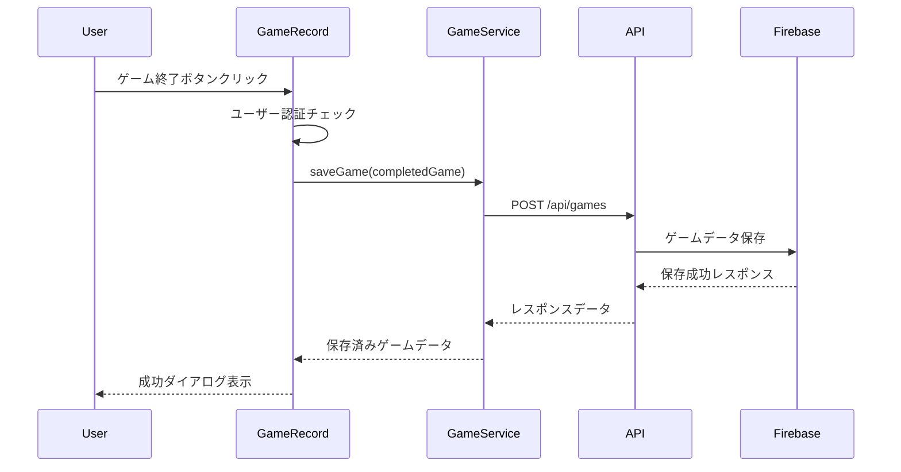
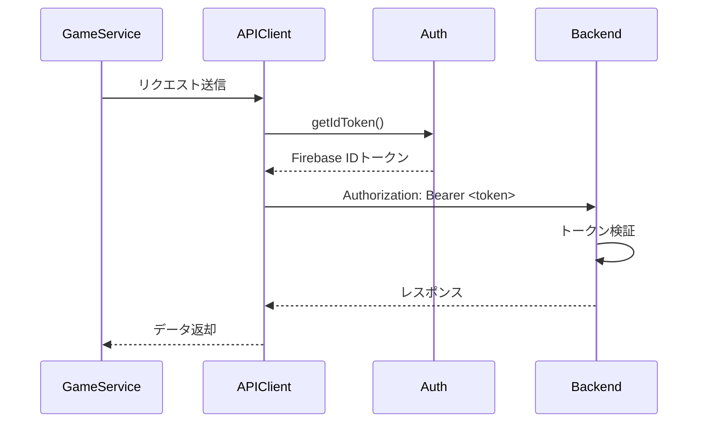

# ゲーム保存機能実装ガイド

## 1. 概要

### 1.1 機能名
ゲーム終了時のFirebase保存機能

### 1.2 機能の目的
ユーザーがボーリングゲームを完了した際に、自動的にゲームデータをFirebase Firestoreに保存する機能を提供する。

### 1.3 実装日
2025年10月4日

## 2. 実装内容

### 2.1 新規作成ファイル

#### 2.1.1 APIクライアント設定
**ファイル**: `frontend/src/services/api.ts`

```typescript
import axios, { AxiosInstance, AxiosError } from 'axios';
import { auth } from '../firebase/config';

// APIベースURL
const API_BASE_URL = import.meta.env.VITE_API_BASE_URL || 'http://localhost:8000/api';

/**
 * APIクライアントの作成
 */
const createApiClient = (): AxiosInstance => {
  const client = axios.create({
    baseURL: API_BASE_URL,
    headers: {
      'Content-Type': 'application/json',
    },
    timeout: 10000, // 10秒のタイムアウト
  });

  // リクエストインターセプター（認証トークンの追加）
  client.interceptors.request.use(
    async (config) => {
      const user = auth.currentUser;
      if (user) {
        const token = await user.getIdToken();
        config.headers.Authorization = `Bearer ${token}`;
      }
      return config;
    },
    (error) => {
      return Promise.reject(error);
    }
  );

  // レスポンスインターセプター（エラーハンドリング）
  client.interceptors.response.use(
    (response) => response,
    (error: AxiosError) => {
      if (error.response) {
        console.error('API Error:', error.response.data);
      } else if (error.request) {
        console.error('Network Error:', error.message);
      } else {
        console.error('Error:', error.message);
      }
      return Promise.reject(error);
    }
  );

  return client;
};

export const apiClient = createApiClient();
```

**主な機能**:
- Axiosクライアントの初期化とベースURL設定
- リクエストインターセプターでFirebase認証トークンを自動付与
- レスポンスインターセプターでエラーハンドリング

#### 2.1.2 ゲームサービス
**ファイル**: `frontend/src/services/gameService.ts`

```typescript
import { apiClient } from './api';

export interface Frame {
  frameNumber: number;
  firstRoll: number | null;
  secondRoll: number | null;
  thirdRoll: number | null;
  frameScore: number | null;
  isStrike: boolean;
  isSpare: boolean;
  isCompleted: boolean;
}

export interface Game {
  id: string;
  userId: string;
  gameDate: string;
  totalScore: number;
  frames: Frame[];
  status: 'in_progress' | 'completed';
}

export const gameService = {
  async saveGame(game: Game): Promise<Game> {
    try {
      const requestData = {
        userId: game.userId,
        gameDate: game.gameDate,
        frames: game.frames,
        totalScore: game.totalScore,
        status: game.status,
      };

      const response = await apiClient.post('/games', requestData);

      if (response.data.success && response.data.data) {
        return response.data.data;
      } else {
        throw new Error(response.data.error?.message || 'Failed to save game');
      }
    } catch (error: any) {
      console.error('Error saving game:', error);
      throw new Error(error.response?.data?.error?.message || 'ゲームの保存に失敗しました');
    }
  },
  
  // その他のメソッド...
};
```

**主な機能**:
- ゲームの保存（`saveGame`）
- ゲームの取得（`getGame`）
- ゲーム履歴の取得（`getGameHistory`）
- ゲームの削除（`deleteGame`）

### 2.2 既存ファイルの変更

#### 2.2.1 GameRecord.tsx
**ファイル**: `frontend/src/components/GameRecord.tsx`

**主な変更点**:

1. **インポートの追加**
```typescript
import { CircularProgress, Alert } from '@mui/material';
import { auth } from '../firebase/config';
import { gameService } from '../services/gameService';
```

2. **状態管理の追加**
```typescript
const [isSaving, setIsSaving] = useState(false);
const [saveError, setSaveError] = useState<string | null>(null);
```

3. **ゲーム開始処理の改善**
```typescript
const startNewGame = () => {
  const user = auth.currentUser;
  const newGame: Game = {
    id: `temp_${Date.now()}`,
    userId: user?.uid || 'anonymous',
    gameDate: new Date().toISOString(),
    totalScore: 0,
    frames: initializeFrames(),
    status: 'in_progress',
  };
  setGame(newGame);
  setCurrentFrame(1);
  setCurrentRoll(1);
  setIsGameCompleted(false);
  setSaveError(null);
};
```

4. **ゲーム終了処理の実装**
```typescript
const handleFinishGame = async () => {
  if (!game || !canFinishGame()) return;

  // ユーザー認証チェック
  const user = auth.currentUser;
  if (!user) {
    setSaveError('ログインが必要です');
    return;
  }

  setIsSaving(true);
  setSaveError(null);

  try {
    // ゲームの状態を完了に変更
    const completedGame: Game = {
      ...game,
      status: 'completed',
      userId: user.uid,
    };

    // Firebaseにゲームデータを保存
    const savedGame = await gameService.saveGame(completedGame);
    
    console.log('✅ ゲームが保存されました:', savedGame);

    // 状態を更新
    setGame(savedGame);
    setIsGameCompleted(true);
    setShowFinishDialog(true);
  } catch (error: any) {
    console.error('❌ ゲーム保存エラー:', error);
    setSaveError(error.message || 'ゲームの保存に失敗しました');
  } finally {
    setIsSaving(false);
  }
};
```

5. **UIの改善**
- 保存中の表示（ローディングスピナー）
- エラーメッセージの表示（Alert）
- 成功メッセージの表示（Dialog）

### 2.3 環境変数の追加

#### 2.3.1 ローカル開発環境
**ファイル**: `env.local.example`

```bash
# バックエンドAPI設定
VITE_API_BASE_URL=http://localhost:8000/api
```

#### 2.3.2 本番環境
**ファイル**: `env.production.example`

```bash
# バックエンドAPI設定
VITE_API_BASE_URL=https://your-api-domain.com/api
```

## 3. データフロー

### 3.1 ゲーム保存のフロー



### 3.2 認証フロー



## 4. エラーハンドリング

### 4.1 エラーケース

| エラーケース | 表示メッセージ | 対処方法 |
|------------|--------------|---------|
| 未認証ユーザー | 「ログインが必要です」 | ログイン画面へ誘導 |
| ネットワークエラー | 「ゲームの保存に失敗しました」 | リトライボタン表示 |
| バリデーションエラー | サーバーからのエラーメッセージ | 入力内容を確認 |
| タイムアウト | 「通信がタイムアウトしました」 | リトライボタン表示 |

### 4.2 エラー表示UI

```typescript
{saveError && (
  <Box sx={{ mb: 3 }}>
    <Alert severity="error" onClose={() => setSaveError(null)}>
      {saveError}
    </Alert>
  </Box>
)}
```

## 5. セキュリティ

### 5.1 認証・認可
- Firebase Authentication IDトークンをリクエストヘッダーに自動付与
- バックエンド側でトークン検証を実施
- ユーザーは自分のゲームデータのみアクセス可能

### 5.2 データ検証
- フロントエンド側でゲーム完了状態を確認
- バックエンド側でデータバリデーション実施
- 不正なデータは保存前にリジェクト

## 6. テスト

### 6.1 テストケース

#### 6.1.1 正常系
| テストケース | 期待結果 |
|------------|---------|
| 全フレーム完了後にゲーム終了ボタンをクリック | ゲームが正常に保存され、成功ダイアログが表示される |
| 認証済みユーザーがゲームを保存 | ユーザーIDが正しく関連付けられる |
| ストライク・スペアを含むゲームを保存 | スコアが正しく計算され保存される |

#### 6.1.2 異常系
| テストケース | 期待結果 |
|------------|---------|
| 未認証ユーザーがゲーム終了 | 「ログインが必要です」エラーメッセージ表示 |
| ネットワーク切断時にゲーム保存 | エラーメッセージ表示、リトライ可能 |
| 不完全なゲームで終了ボタンクリック | ボタンが無効化されクリック不可 |

### 6.2 手動テスト手順

1. **前提条件**
   - ローカル開発環境が起動済み
   - Firebase認証でログイン済み

2. **テスト手順**
   ```
   1. ダッシュボードから「ゲーム記録」画面に遷移
   2. 各フレームのスコアを入力（全10フレーム）
   3. 最終フレーム完了後、「ゲーム終了」ボタンをクリック
   4. ローディングスピナーが表示されることを確認
   5. 成功ダイアログが表示されることを確認
   6. ゲーム履歴画面で保存されたゲームを確認
   ```

3. **確認項目**
   - [ ] ゲームデータがFirestoreに保存されている
   - [ ] 保存されたゲームIDが正しい
   - [ ] ユーザーIDが正しく関連付けられている
   - [ ] スコアが正確に計算されている
   - [ ] タイムスタンプが正しい

## 7. パフォーマンス最適化

### 7.1 実装済み最適化
- Axios Interceptorによる認証トークンの自動キャッシュ
- エラーレスポンスの適切なハンドリング
- タイムアウト設定（10秒）

### 7.2 今後の最適化案
- オフライン時のローカルストレージへの一時保存
- 保存失敗時の自動リトライ機能
- バックグラウンドでの自動保存機能

## 8. 使用方法

### 8.1 開発者向け

#### APIクライアントの利用
```typescript
import { apiClient } from '../services/api';

// GETリクエスト
const response = await apiClient.get('/games/history');

// POSTリクエスト
const response = await apiClient.post('/games', data);
```

#### ゲームサービスの利用
```typescript
import { gameService } from '../services/gameService';

// ゲーム保存
const savedGame = await gameService.saveGame(game);

// ゲーム取得
const game = await gameService.getGame(gameId);

// ゲーム履歴取得
const { games, total } = await gameService.getGameHistory(10, 0);
```

### 8.2 ユーザー向け

1. **ゲームを開始**
   - 「ゲーム記録」画面に移動
   - 各フレームのピン数を入力

2. **ゲームを終了・保存**
   - 全フレーム完了後、「ゲーム終了」ボタンをクリック
   - 保存が完了すると成功メッセージが表示される
   - 「履歴を見る」ボタンで保存されたゲームを確認可能

3. **トラブルシューティング**
   - エラーが表示された場合は、ログイン状態とネットワーク接続を確認
   - 問題が解決しない場合は、ページを再読み込み

## 9. 依存関係

### 9.1 新規追加パッケージ
なし（既存のaxiosパッケージを使用）

### 9.2 必要な環境変数
- `VITE_API_BASE_URL`: バックエンドAPIのベースURL
- `VITE_FIREBASE_*`: Firebase設定（既存）

## 10. 今後の改善案

### 10.1 機能追加
- [ ] オフライン対応（Service Workerの利用）
- [ ] 自動保存機能（一定間隔での保存）
- [ ] 保存前のプレビュー機能
- [ ] ゲームデータのエクスポート機能

### 10.2 UI/UX改善
- [ ] 保存進捗の詳細表示
- [ ] アニメーション効果の追加
- [ ] モバイル端末での最適化
- [ ] ダークモード対応

### 10.3 パフォーマンス改善
- [ ] リクエストのキャッシュ戦略
- [ ] バックグラウンド同期
- [ ] 画像の最適化（将来的にスクリーンショット機能追加時）

## 11. 変更履歴

| バージョン | 日付 | 変更内容 | 担当者 |
|----------|------|----------|--------|
| 1.0.0 | 2025-10-04 | 初版作成 - ゲーム保存機能実装 | システムエンジニア |

---

**注意事項**:
- この実装ガイドは、ゲーム保存機能の実装内容を記録したものです
- 実装に変更があった場合は、このドキュメントも更新してください
- 質問や問題がある場合は、開発チームに相談してください

